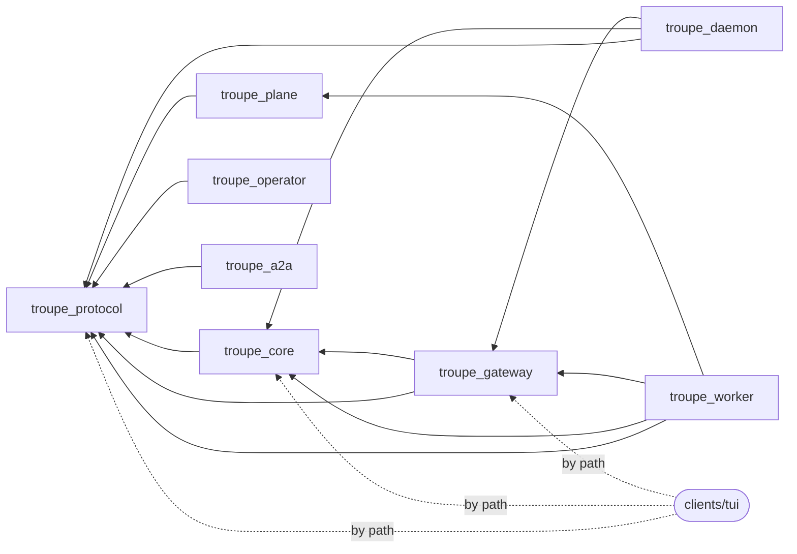
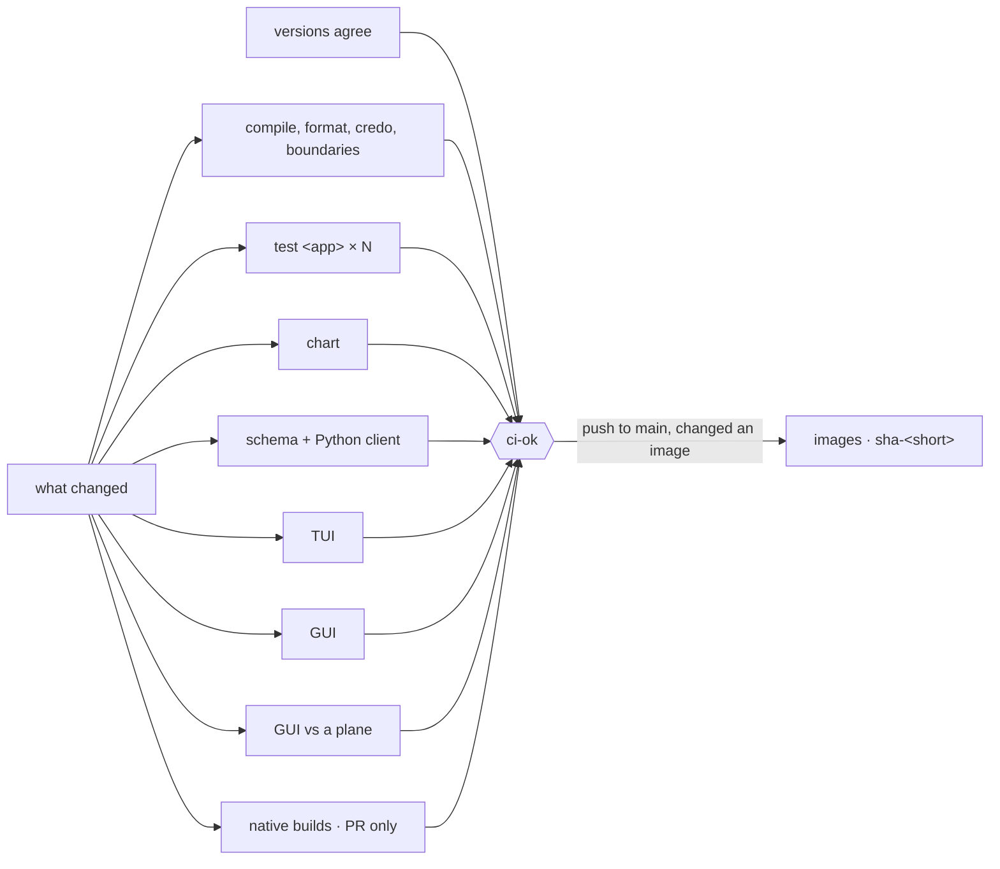
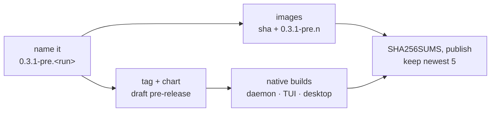
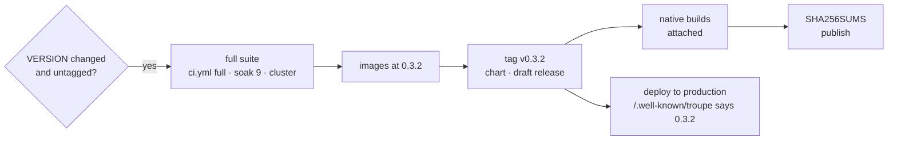

# CI, pre-releases and releases

Three speeds, one set of jobs (Decision 676):

| | when | runs | publishes | deploys |
|---|---|---|---|---|
| **Focused CI** — [`ci.yml`](workflows/ci.yml) | every pull request, every push to `main` | only what the change can have broken | `main`: the five images as `sha-<short>` | nothing |
| **Pre-release** — [`prerelease.yml`](workflows/prerelease.yml) | by hand, any branch or commit | builds only, **no test suite** | a GitHub pre-release `v<VERSION>-pre.<n>`: images, chart, `troupe`, `troupe-daemon`, desktop installers | nothing |
| **Release** — [`release.yml`](workflows/release.yml) | merging a VERSION change (`scripts/release 0.3.2`) | **the full suite**: every job, nine soak runs, the cluster suite | the GitHub release `v<VERSION>`, images and chart at that version | production |

Plus [`nightly.yml`](workflows/nightly.yml) — the full suite, the native builds and the harness against a real model on `main` every night, publishing nothing — and [`deploy.yml`](workflows/deploy.yml), which rolls back to or renders a published release by hand.

## Focused CI: what a change runs

`changes` compares the change with its base and plans the run. Umbrella apps are chosen from the dependency graph the apps' own `mix.exs` files declare, so a change to an app tests it and **every app that depends on it**, and nothing else:

Arrows point at what an app depends on; a change flows back along them. So:

| the change touches | umbrella suites | also |
|---|---|---|
| `clients/gui/**` | — | GUI (tokens, typecheck, build, test); GUI-e2e if the client package |
| `clients/tui/**` | — | TUI `mix check`; native builds (PR) |
| `apps/troupe_daemon` | daemon | native builds (PR) |
| `apps/troupe_plane` | plane, worker | GUI-e2e |
| `apps/troupe_operator` / `troupe_a2a` | that app | — |
| `apps/troupe_core` | core, gateway, daemon, worker | TUI, protocol, GUI-e2e |
| `apps/troupe_gateway` | gateway, daemon, worker | TUI, protocol, GUI-e2e |
| `apps/troupe_protocol`, `config/`, `mix.lock` | all eight | TUI, protocol, GUI-e2e |
| `charts/`, `docker/` | — | chart (lint, render, kubeconform), GUI-e2e |
| `PROTOCOL.md`, `protocol/`, `VERSION`, `.tool-versions`, `.github/workflows/` | everything | |
| anything else (docs) | — | only `versions` |

Each umbrella app is its own parallel leg (`test <app>`), and one `lint` job compiles the whole umbrella with warnings as errors and runs format, credo, the generated-asset checks and the boundaries whenever any app is under test.

`ci-ok` is the one required check: it fails if any job that ran failed, and a job skipped because its part of the repository did not change counts as passing. A push to `main` publishes the images once `ci-ok` has passed. The soak and the cluster suite are not in focused runs any more; they belong to the nightly and to releases.

## Pre-release: a build to try, now

`Actions → pre-release → Run workflow`, with a branch, tag or commit. About twenty minutes, most of it the Windows and macOS builders.

- **No test suite.** The native jobs' own smoke tests still run (`--version`, a headless run in the embedded daemon), because a binary that cannot start is not a build.
- The daemon, the TUI and the plane report the pre-release's version. The desktop installers keep VERSION's number: an MSI version must be numeric.
- It is a GitHub *pre-release*, so `/releases/latest` and the installers' default never pick it up. The `install.sh` and `install.ps1` attached to it install it (`scripts/release-installers` pins them), and so does naming it:
  `TROUPE_VERSION=0.3.1-pre.12 sh install.sh` or `$env:TROUPE_VERSION = "0.3.1-pre.12"; .\install.ps1`.
- Nothing is deployed. Its images can be deployed by hand like any others.
- Only the newest five are kept (`keep`); older pre-releases and their tags are deleted. Release candidates (`-rc.N`) are releases and are never touched.

## Release: the full suite, then everything

`scripts/release 0.3.2` opens the pull request that changes VERSION. Merging it is the release:

- The full suite is `ci.yml` called with `full: true`: every job whatever changed, each app's suite nine more times, and the cluster suite on kind. Nothing is trusted from an earlier run.
- The images are built from the commit being released and tagged with the version; the chart is packaged at that version, so it pulls exactly those.
- A release candidate (`0.4.0-rc.1`) runs all of it and deploys as a dry run.
- A release whose run failed after VERSION merged can be retried with `Actions → release → Run workflow`: by hand it cuts VERSION's version if that has no tag yet.

## Nightly

The full suite and the native builds on `main` at 02:17 UTC, publishing nothing — so a race, a cluster regression or a broken Windows build shows up the next morning, not in the middle of a release.

### The live check

[`live.yml`](workflows/live.yml), in the same run: the harness against a real model, through the LiteLLM gateway. Everything else here uses the scripted `fake` model, which does as it is told; the sessions that ran away with real money did so on a real one. `scripts/install-local --tui` builds `troupe-daemon` and `troupe` from the commit, as a person building from source would, and [`scripts/live-check`](../scripts/live-check) makes three `troupe run build … --headless` runs, each in an empty workspace with its own daemon, its own config and a five-minute timeout:

| run | passes when | a failure means |
|---|---|---|
| **a headless task**: write `hello.txt` with one given line, then stop | exit 0, the file holds the line, the log has a `turn_ended` | the headless runner does not exit when a real model ends its turn in prose (#127), or the task was not done |
| **a delegation**: find a fact in `notes/` through one `explore` subagent | exit 0, and a `delegate` call whose result is the subagent's summary or its honest note that it was cut short (#130) | the delegation never happened, failed, or came back empty. The fact missing from the final answer is a warning, not a failure |
| **a failing tool loop**: read a file that is never there, and keep retrying | the failure guard stops the turn after three failed reads: `turn_ended` with `reason: tool_failures`, exit 1 | a budget stopped the loop and the guard did not (#117), or the job's own timeout did and nothing in the harness had. *Inconclusive* means the model gave up by itself before the third failure, so the guard was not reached |

A failure is a harness regression until shown otherwise: the step prints the run's output and, on failure, the session's log (one event a line) and the daemon's. A warning is about what the model said and needs nothing unless it repeats.

**What it may spend.** Each run's user config limits an agent to 12 model calls, 200,000 input tokens, 24,000 output tokens and four minutes, and a spent budget stops rather than asks (`budget_asks: false`). The project brief's automatic refresh is off (`memory_auto_refresh: false`), so no librarian starts. The job stops at 20 minutes whatever happens, and the key itself is capped at the gateway at about $2 a day, so a night that runs away costs that at most. The job summary lists each run's model calls and tokens, and the gateway's price for them where it gives one; for `qwen3-235b` it gives none, and the column says so. A night that goes as it should is some tens of thousands of input tokens.

**By hand**, alone: `gh workflow run nightly.yml -f only=live`, with `--ref <branch>` to try a branch before it merges, or `Actions → nightly → Run workflow` with *only* set to `live`. `all` is the whole nightly, about seventy minutes. GitHub offers a dispatch only for a workflow `main` has, and the run then uses the branch's copy of it.

## Files

| workflow | what | called by |
|---|---|---|
| `ci.yml` | every check; focused or full | pull requests into `main`, pushes to `main`, `nightly.yml`, `release.yml` |
| `dev-check.yml` | compile, credo, schema, client builds; no tests | every other pull request: into a `development-*` chunk ([fixing-issues.md](../docs/developer/fixing-issues.md)), or stacked on another branch |
| `images.yml` | the five images, `sha-<short>` and an optional version | `ci.yml` (main), `prerelease.yml`, `release.yml` |
| `native.yml` | `troupe-daemon` ×5, `troupe` ×5, desktop ×3; optionally attached to a release | `ci.yml` (PRs that touch them, without macOS), `nightly.yml`, `prerelease.yml`, `release.yml` |
| `prerelease.yml` | an untested pre-release of any commit | by hand |
| `release.yml` | full suite → tag → publish → deploy | a VERSION change on `main`; by hand to retry |
| `nightly.yml` | full suite + native builds + the live check; `only: live` for the last alone | schedule; by hand |
| `live.yml` | three headless runs against the real gateway | `nightly.yml` |
| `deploy.yml` | roll back to, or render, a published release | by hand |

## Secrets and variables

| Name | Kind | Used by |
|---|---|---|
| `REGISTRY`, `REGISTRY_NAMESPACE`, `REGISTRY_USERNAME`, `REGISTRY_PASSWORD` | repository secrets | `images.yml`: all four or none. Without them nothing is published and the run says which are missing; a release fails, because a release is its images |
| `GUI_BASE` | repository variable | `images.yml`: the GUI's mount path baked into its assets, default `app` |
| `APPLE_*`, `AZURE_*` | repository secrets | `native.yml`: sign the desktop installers; absent, they are unsigned ([install.md](../clients/gui/docs/install.md)) |
| `KUBECONFIG`, `DEPLOY_VALUES` | `production` environment secrets | `release.yml`, `deploy.yml`: the `troupe-deployer` account's kubeconfig (`deploy/ci-deployer.yaml`, then `scripts/ci-kubeconfig`) and the deployment's Helm values |
| `PLANE_URL` | `production` environment variable | where `scripts/deploy` asks `/.well-known/troupe` which version and commit is running |
| `TROUPE_NIGHTLY_BASE_URL`, `TROUPE_NIGHTLY_API_KEY` | repository secrets | `nightly.yml` → `live.yml`: the LiteLLM gateway (OpenAI-compatible, with `/v1` or without) and a key for it, capped there at about $2 a day. Without both the live check fails and says so |
| `TROUPE_NIGHTLY_MODEL` | repository variable | the model the live check runs, by the gateway's name for it; default `qwen3-235b`, the model the runaway sessions were on |

`production` should allow `main` alone, so no pull request reaches its secrets. The review
of the pull request that changed `VERSION` is the approval, unless the environment adds a
required reviewer.

The gateway's key is a repository secret and not an environment's, because the live check
runs on any branch it is dispatched on. What keeps it from a pull request is that only
`nightly.yml` calls `live.yml`, on a schedule or by hand, and the job that holds it runs
for those two events and no other.
