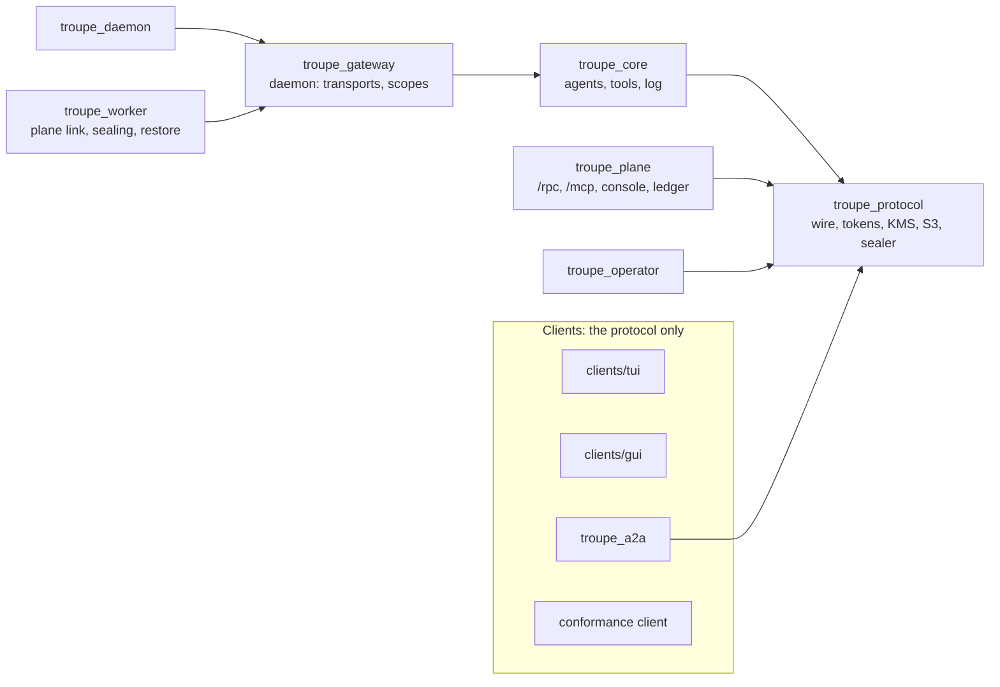
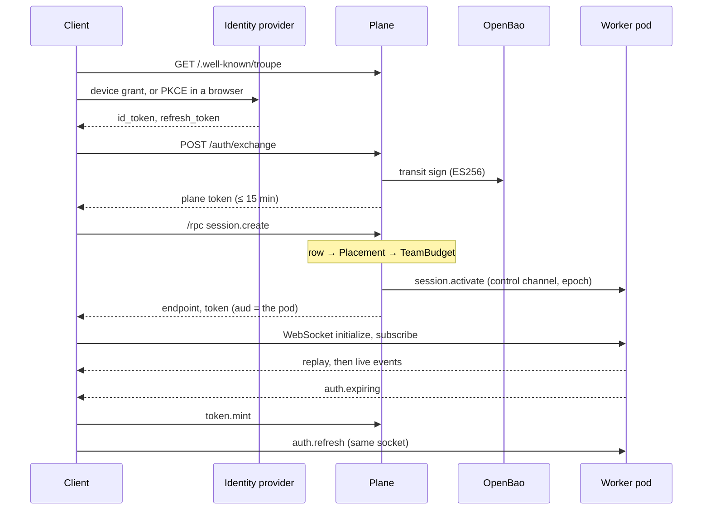

# Troupe — Architecture

Troupe runs coding agents. A **session** is an agent tree, its workspace and an
append-only, hash-chained log; a **harness** is any client that attaches to one over
[PROTOCOL.md](PROTOCOL.md). A session is owned by a daemon — `troupe-daemon` on a laptop,
or the same code on a worker pod — and the screen is a client, one of several, possibly on
another machine. One sentence organises everything below: **the log is the session.**
Every client view, every restart and every audit is a fold over it; the plane keeps an
index of logs and never their content.

Read this before changing `apps/troupe_core`, `troupe_gateway`, `troupe_protocol` or a
client. Where things are in the code: [docs/developer/architecture.md](docs/developer/architecture.md).
Why each choice was made: [DECISIONS.md](DECISIONS.md), by number.

## 1. Shape

`mix troupe.boundaries` reads the compiled beams and fails on any other edge. Three rules
carry the design:

- **A client gets no private access.** The A2A facade depends on `troupe_protocol` alone,
  the TUI reaches the harness only through a handful of doors (`mix troupe.xref`), and the
  GUI depends on nothing here but the protocol. If one client can do something, a
  third-party client can, because there is no other door — and the Python conformance
  client, written from `PROTOCOL.md` alone, proves it in CI.
- **The plane never depends on `troupe_core`.** It knows *that* a session exists and who
  may see it; it never runs an agent.
- **The operator depends on neither.** It holds cluster privileges and has no public
  surface, so compromising the internet-facing plane yields requests that still have to
  pass policy, not a cluster.

Remotely, a **plane** decides who may use what and where a session runs, an **operator**
turns a `WorkerProfile` into a namespace of **worker pods**, and a client talks to the pod
directly with a short-lived token (§6).

## 2. The harness

### 2.1 A session

Every agent, model request, tool run, subagent and watcher is a process; they share
nothing and handle failure by supervision. A session is a `rest_for_one` supervisor
ordered by dependency: `Session.Log` first, because everything persists through it;
`Approvals`, `Questions`, `ClientTools` and the workspace's MCP servers above the agent, so
a restarted agent finds the same answers and registrations; the root `Agent.Node`; then
`Watcher` and `Files`, so file watching can never disturb a running agent; and
`Session.Summary` last, because a projection that could restart an agent by crashing would
be worse than none. Sessions live in the core's own tree, not the daemon's, so a daemon can
lose its listener and every client without an agent noticing.

### 2.2 The agent

`Agent.Server` is a `:gen_statem` over `:idle`, `:thinking`, `:acting`, `:compacting`
and `:done`. The mailbox never blocks: the model request streams back from its own task,
tool calls run in their own tasks concurrently and are reassembled in call order, and the
only synchronous calls out are to `Session.Log`, which never calls back.

| State | Event | Next |
|---|---|---|
| idle | input | log it; budget check; start the stream → thinking (or done, budget) |
| thinking | stream done with tool calls | acting |
| thinking | text only | done (`finished`) — an implicit finish |
| thinking | prompt over the compaction threshold | compacting |
| thinking | cut at the output cap, or empty | note it and re-issue once, then done (`output_truncated`, `empty_reply`) |
| thinking | refusal, model error | done (`refused`, `llm_error`); a context overflow compacts once and retries |
| acting | each call | allowlist and permission check → error result, approval request, or a task |
| acting | approval, answer, tool result, child result, a task's `DOWN` | record it; when none are outstanding, the next turn |
| compacting | summary | carry on the interrupted turn, or come to rest |
| done | input | a root agent that finished takes it as a new turn; one out of budget stays done |
| any | cancel | kill tasks and children → done (`cancelled`) |

Input arriving while busy is postponed with `gen_statem`'s `:postpone`, not a hand-rolled
queue, and delivered at the turn boundary. **Replay**: an agent's state is a fold over its
own events; a crashed agent rebuilds from the log and finishes what it started, never
re-running a completed call. **Budgets** — turns, input and output tokens, working time —
are checked before every request; a child gets a share of its parent's. Past `warn_at`
(0.8) a dimension logs one warning; at the ceiling the agent asks the person attached, and
a grant buys another slice, folded from the log (Decision 660). **Compaction** is planned
against the whole prompt including cache reads, keeps the recent turns and logs the
replacement conversation so replay is faithful.

### 2.3 Tools

A tool implements `Troupe.Tool`; authorisation happens before anything runs — an unknown
tool, one outside the definition's allowlist, or one denied is refused, and `ask` blocks
that call's task, not the agent. Reads are automatic; `write_file`, `edit_file`, `shell`,
`publish`, `import` and `web_fetch` ask by default; MCP tools take their server's
permission. A write can never leave the workspace root; a read may also reach the
configured `read_roots`; both compare canonical paths. The runner is the one place
`rescue` is used: a raise, exit or timeout becomes an error result the model can read.
Every OS process runs under **`reaper`**, a small Zig program owned by a Port, so killing
the VM kills everything it started. On a pod, `shell` runs under bubblewrap with the
session's mount table as its bind list.

Results are **bounded where they are created** — head and tail of command output, a window
of a file, the first items of a listing — with a marker naming the exact call that returns
the rest; nothing already in the conversation is ever rewritten, because that would
invalidate the provider's prompt cache. The prompt is ordered for the cache: tools in a
fixed order, then a system prompt fixed for the agent's life (definition, project brief,
workspace survey), then an append-only history; per-turn state rides after the last cache
breakpoint.

### 2.4 Failure matrix

| What dies | What restarts | Observed |
|---|---|---|
| a tool task | nothing; the agent gets `DOWN` or a timeout | an error result; the agent carries on |
| the model stream | nothing | the agent ends `llm_error` |
| `Agent.Server` | `Agent.Node` (`one_for_all`) restarts it with its tasks and children, from the log | started-but-unfinished calls re-run (at least once) |
| a subagent's node, past its restart limit | nothing; the parent gets `DOWN` | an error result for that delegation only |
| `Watcher`, `Files`, `Summary` | that child and those after it | a notice |
| `Approvals`, `Log`, or the session past 3 restarts in 10 s | everything below it; the whole session | a restarted tree replays; a stopped one comes back dormant from its log |
| the VM | nothing | sessions come back dormant; one mid-turn is **interrupted** |
| the reaper's Port | — | the reaper kills the process tree; an error result |

An **interrupted** session makes no model call until someone activates it, and its
unfinished calls are closed as errors naming the interruption: a crash loop that resumed
by itself would spend money and re-run shell commands nobody is watching.
`resume_on_restart: true` opts back in.

### 2.5 Agents, skills and the brief

Agent definitions are markdown with YAML frontmatter, loaded lowest to highest from the
built-ins (`apps/troupe_core/priv/agents/`), the profile's bundle, the config directory and
the workspace's `.troupe/agents/`. A session has one root agent; `/<agent> prompt` opens a
**branch**, which is a session of its own with a `parent`. Skills follow the Agent Skills
convention and are disclosed progressively: one line per skill in the system prompt, a
`skill` tool that returns the body, and a read-only `skills:/` mount. The **project
brief**, `.troupe/memory.md` at the repository root, is read into every prompt once and
written by `remember` and a `librarian` agent. **Watch mode** acts on `AI!`, `AI?` and
`AI` comments in saved files and ignores the agent's own writes by content hash.

## 3. The wire

`PROTOCOL.md` is normative, written for someone implementing a client without this
repository. What a reader of this code needs:

**Transports.** One JSON-RPC framing: a Unix socket (mode 0600) or loopback TCP with a
token in a user-only file for local clients — `AF_UNIX` is chosen by trying it, because it
is a property of the OTP build — and a WebSocket, one message per text frame, for a pod and
for the daemon's loopback door that a browser can use.

**Events.** A durable event carries `seq`, `prev_hash`, `ts`, `actor`, `agent`, `type`,
`v` and `data`; the hash chains it to the previous one over canonical JSON (keys sorted,
no whitespace), so a client can verify a log without trusting whoever handed it over.
Ephemerals (`llm_delta`, `presence`, `summary_diff`, …) have no `seq`, are never
persisted and may be dropped; every completed model message also lands as a durable
`llm_response`. **`Session.Log` is the only publisher of durable events**, publishing what
it just wrote, in the shape it wrote — otherwise a subscriber sees each fact twice in two
shapes, and the difference only shows under replay.

**Subscriptions** return `head_seq`, replay from the cursor, then follow live with no gap
and no duplicate: the connection holds the cursor, so the switch is one decision in one
process. **Backpressure** has two budgets: ephemerals are refused once a client has more
than its byte bound outstanding; durable events are never dropped for memory, and past the
backlog bound the subscription ends with `resync_required` and the last `seq` delivered. A
`Writer` process per connection owns the blocking send. Nothing blocks the publisher: a
test stalls a socket and requires turn latency within 10 % of baseline. **The summary
projection** folds a session into a compact snapshot and publishes diffs at most four times
a second, so a fleet view need not follow twenty detail streams.

**A command is an acknowledgement, never an effect.** `input.send` returns `accepted`;
what happened arrives as events, so every client learns it the same way. Every
state-changing command carries a client-generated `command_id`, claimed *before* the
command runs and remembered for 30 minutes, so a retry after a disconnect gets the same
answer and never a second effect. **Scopes** — `observe` reads, `control` steers, `admin`
administers — are checked once per method.

## 4. Lifecycle, worktrees and blobs

| State | Tree | A subscribe |
|---|---|---|
| `active` | running | replays, then follows |
| `dormant` | stopped | serves history from the log; starts nothing |
| `read_only` | stopped | as dormant; activating commands are refused |
| `erased` | gone | `not_found` |

A session goes dormant after its idle timeout; the next *activating* command restores the
tree by folding the log. A daemon restart brings sessions back dormant — restarting every
session a person ever had is a stampede, not a restoration — and stops itself after a quiet
period with no clients. `Sessions.Index` holds metadata only and monitors each live tree,
so a crashed session leaves the live view at once. The TUI's HQ page is a `fleet`
subscriber plus one `session.list`: every approval waiting on a person, including in
sessions nobody has open.

A second live session in a workspace gets its own **git worktree** on `troupe/<slug>`, so
two agents never see each other's half-finished edits as the user's; removal refuses a
dirty tree unless forced. A tool result over 16 KiB becomes a **blob** reference fetched
with `blob.get` (byte ranges); replay resolves it back, because a restarted agent must
rebuild the conversation the model actually saw. Blobs deduplicate within a session only,
so one session's storage is never a probe for another's content.

## 5. Several harnesses, one session

Every input enters the session actor's mailbox, so **the log order is the order**; no
clock is involved. An input that arrives while the agent is busy produces a durable
`input_queued`, and `input_accepted` carries the author and the `command_id`, which lets a
client show its own input as queued and reconcile against what happened. **Presence** is
ephemeral structurally: it is published through a path with no route to the log.
**Client-hosted tools** — a person's own MCP server offered to a session — need consent as
a round trip (`consent.challenge`, shown to the person, carried in the registration); only
the registering connection can be asked to run one, a disconnect mid-call is an error
result, and every registration durably **taints** the session so the other participants
know something runs on somebody's machine.

## 6. Remote

### 6.1 The plane

The plane decides *what* may happen and *where*; it never sees what happens, and is never
in the data path of a live session. **Identity**: it is a plain OIDC relying party;
`/auth/exchange` verifies the provider's token and mints a plane token signed through
OpenBao's transit engine, so the plane holds no key it could leak (`kid` is the RFC 7638
thumbprint, so plane and workers agree with nothing kept in step).

**The control channel.** Workers dial an internal TCP listener, never exposed through
ingress, with their projected ServiceAccount token; a `TokenReview` validates it and **the
namespace decides the profile**, so a pod can only enrol as what it is. Upward flow
heartbeats, the session *index* (ids, epochs, sequence numbers, head hashes), status
columns and usage batches; downward, idempotent pushes — activate, drain, erase, fence,
JWKS and ACL changes, `config.updated` — routed to whichever replica holds the pod. Bundles
and key-manager assertions are fetched, not pushed: `kms.assertion {session_id}` answers a
short-lived JWT for *that session owner's* key slots, the subject read off the session row,
so a pod naming a session it does not hold gets `not_found`.

**The harness API** (`/rpc`) is a fleet API: `me`, `teams.list`, `profiles.list`,
`sessions.list`, `session.get`, `session.create`, `session.open`, `token.mint`, pin,
erase, `session.grant`, `session.review`, `trigger.fire`. `session.create` is a sequence
of reservations, each given back if a later one fails: row → capacity (`Placement`) →
budget (`TeamBudget`) → push to the pod → token. The row comes first because a placement
is a conditional write against it, which survives the replica that made it. `Placement`
and `TeamBudget` are one `:global` actor per profile and per team, which is why plane
replicas must cluster. `session.open read` never activates — a session that woke because
somebody looked would never stay dormant — and in `activate` mode a conditional epoch bump
decides the one caller that places it. `sessions.list` carries the status columns a pod
reports (`status`, `done_reason`, `pending_approvals`, `cost_micros`), so a review queue is
a listing and not a replay. There is no plane push to clients: `/rpc` is request and
answer.

**Tokens for pods.** `aud` is **the pod's worker id** — an audience naming the profile
would make pods interchangeable, which is what a leaked token wants. Workers verify offline
against a cached JWKS, warn with `auth.expiring` two minutes out and accept `auth.refresh`
on the open socket. The role in a token is a claim about the moment it was minted; access
is checked again on every command against the ACL mirror the plane pushes, so a revoked
collaborator is refused on their next command.

### 6.2 A worker pod

**One process per active session, none per dormant one.** Everything a dormant session is
lives in object storage, and activation is the only way back — which makes relocation and
losing a volume the same operation. **Sealing**: a sealer per active session uploads an
AES-256-GCM segment at every turn's end and at least every 60 s; that interval is the whole
durability promise. Upload, *then* report: a segment the plane knows of but storage lacks
would let a rebuild claim history it cannot produce. The same `Troupe.Sessions.Sealer`
runs on a pod and in a daemon, so either can restore the other's sessions.

**Dormancy** is: record, seal, stop the tree, archive and upload the workspace, report,
then erase the local copy. **Epochs** are minted by the plane alone; a pod whose epoch has
passed refuses to activate (checked against the plaintext manifest before decrypting), and
a fenced running session stops and discards its cache. **Draining** — scale-down, a new
image, an admin's drain — stops placement in the database, waits for running turns up to
the grace period, and the plane checks its own index before agreeing the pod is empty.
**Disk pressure** evicts caches, least recently used, never an active workspace. **Erasure**
is driven by the plane and done by a pod, since only a pod holds the key and storage
credentials: the key is destroyed **first**, so nothing under the prefix decrypts — not
old object versions, not backups — and the deletion after it is tidiness. An offline pod
applies pending erasures when it enrols.

### 6.3 The operator

| Resource | Scope | Written by | Says |
|---|---|---|---|
| `TroupePolicy` | cluster | a cluster admin, never the plane | what any profile may ask for |
| `WorkerProfile` | `troupe-system` | the plane | what one pool of workers should be |
| `TeamVolume` | `troupe-system` | — | that a team has shared storage |

`spec.teams` is a projection of the plane's grants, not a second source of truth.
**Policy is checked twice, on purpose**: a `ValidatingAdmissionPolicy` gives a person an
error at the moment they ask; the operator's check still holds when admission is down or
the policy tightened afterwards. `Resources.for_profile/3` is a **pure function** from
profile, policy and settings to manifests, so naming, addressing and egress are tested
without a cluster, and the reconciler only applies and compares — level-triggered and
idempotent, pruning by label (owner references cannot cross namespaces), led by a `Lease`.
A pod gets a *projected* token with audience `troupe-plane`, never the ServiceAccount's own,
so it cannot be replayed against the API server. StatefulSets are `OnDelete` because a pod
holds live sessions. **Egress** is default-deny: DNS, the plane's control port, OpenBao,
object storage, the model, the profile's MCP servers and git hosts. Plain NetworkPolicy
cannot name a host, so without Cilium the external ones are a wide rule, recorded rather
than hidden; with Cilium the operator writes the `toFQDNs` rule the profile asked for.

### 6.4 The admin surface

Every administrative action goes through `Troupe.Plane.Admin`, and the console, the
`admin.*` JSON-RPC methods and the MCP server at `/mcp` are renderings of it. A LiveView
may call nothing else in the plane, and a parity test asserts every function has an API
method and an MCP tool — so nothing the console can do is out of reach of a program or a
model. For a model the method's summary and typed arguments *are* the interface, and a
destructive tool takes a `confirm` argument repeating the identifier. `/mcp` also accepts
the identity provider's own token, because an MCP client does OAuth against the provider
and has no step at which to get a plane token; Troupe is a resource server, never an
authorization server.

`platform_admin` is membership of an identity-provider group — never granted in Troupe,
because a role Troupe could grant would be a way to escalate inside it. `team_admin` is
assigned per team. Neither can read session content: no admin method returns events.
Break-glass is a separate, audited console login for a lock-out, with no more access.
Profiles are applied **directly** (server-side apply) or **by GitOps** (a commit; shown as
pending until the resource's generation catches up). **Settings** override the deployment
and never replace it: a stored row wins, reset deletes it, and a `platform_admin_group`
cannot be saved until a check passes for the value in the field. **Audit** is a row per
change with the actor and a diff keyed by path (`spec.llm.model`), computed by the same
function the editor previews with.

## 7. What a profile carries, and work nobody starts

**Bundles** — agent definitions, skills and MCP servers — are one versioned, hashed,
immutable document per version, validated at publish by the plane and again by the worker
after checking the hash. A worker keeps every version under `bundles/<hash>/`, so a session
pinned to a version reads that version however many have been published since; retiring it
moves pinned sessions on at their next activation. MCP servers have one source of truth,
the bundle: pods discover tools on `config.updated` and apply its allowlist, and the plane
writes the servers into the `WorkerProfile` so the operator opens egress and injects each
credential from `troupe-mcp-<name>`.

A **service principal** (`svc:<team>/<name>`) is a credential a team owns, not a member,
which keeps membership the identity provider's business; it exchanges its secret for the
same plane token a person gets and has no admin role. `session.create` takes what an
unattended session needs: a first `prompt` the plane passes on and never stores; `terms` —
a budget slice, `max_turns`, `wall_clock_seconds` and `approvals: wait | deny`, with no
`auto` (a trigger that needs none runs a profile whose bundle sets those tools to `auto`,
an administrator's versioned act); and an `origin`. A **trigger** is a row the plane stores
and something fires: `trigger.fire` renders the template and creates the session *as the
trigger's principal* through the same call a person's client makes; the same idempotency
key returns the same run. Cron triggers fire from a `:global` scheduler in the plane;
webhooks terminate at an external executor, so the plane has no public trigger surface.

**The A2A facade** maps the A2A protocol onto sessions: a task is a session, a message is
`input.send`, a stream is a subscription, `input-required` is an approval answered by a
structured decision, artifacts are `published` events and blobs served with the caller's
own token. It holds no database and no credential of its own ([docs/a2a.md](docs/a2a.md)).

## 8. What a session cost

**Cost is a fold over the log, not a second thing to write down.** Every `llm_response`
carries the model and, behind a gateway, its request id and cost, read from response
headers (`x-litellm-call-id`, `x-litellm-response-cost`). **Troupe has no price table**:
the gateway has priced the call, and a reconciliation compares the ledger with it by
request id; where the gateway said nothing, tokens are recorded at zero cost with a
synthetic id `seq:<session>:<n>` that the reconciliation counts as unmetered.

On a pod, `Session.Log` hands each event to a usage fold that writes an ETS row from the
log's own process — no mailbox on the turn path — drained in batches over the control
channel. The plane answers each batch with `usage_seq`, the highest sequence now recorded;
the pod drops what it held up to it and, after a restart, re-folds its log from it. The
watermark only moves forward and is deliberately not fenced on the epoch, because a fenced
pod still made the calls it reports. The ledger's uniqueness on request id turns any
overlap into duplicates rather than charges. There is no rollup pipeline: the raw table,
an index and a one-minute cache answer every question at this volume.

## 9. Provenance and entitlements

A trigger run names a **revision**: the trigger document frozen and addressed by the hash
of its canonical form, `source` inside the hash and `enabled` outside it. Editing a
template no longer rewrites what old runs ran, and the session a run made carries the hash
in its origin. A grant may carry **entitlements** — which of a bundle's agents, skills and
MCP servers come with it; no rows is no restriction, `deny` wins. The bundle is never
altered: the plane resolves a set at create, `profiles.list` shows the union across a
person's teams, the session gets its one team's set, and the pod filters agents after the
whole search order is merged, skills after the definition's own list, and each session's
MCP tool list — the pod still discovers once.

## 10. What belongs to a person

Key paths take an owner: `troupe/teams/<team>/sessions/<id>` for a pod, scoped to its
granted teams, and `troupe/people/<subject>/…` for a person, which no pod rule mentions. A
bundle's MCP server may use `credential_mode: person` — the session owner's credential,
fixed at activation — kept at `troupe/people/<subject>/mcp/<slot>`, which only that person
can read: the pod exchanges a plane-signed assertion at OpenBao's JWT auth for a token
templated on the subject, and a person connects a server with `me.connections.grant`, which
takes no value and returns none. Where nobody has connected, the tool answers
`not_connected` rather than a 401 the model would retry.

A **private session** runs on a person's machine and never touches a pod. The daemon seals
it with the same sealer under the person's key subtree; the plane holds a row
(`kind: private`, no team, no profile) and nothing else. Bytes cross through presigned URLs
for one key under the session's prefix (`session.presign`), listing through
`session.objects`, and the **epoch** fences two devices waking the same session:
`session.register` with `claim: true` bumps it conditionally, and the loser learns at its
next seal and keeps its local log read-only. The daemon's plane token comes from the
client that signed in (`identity.link`) and is held in memory only.

## 11. Reading old logs

Every durable event carries a schema version. `Troupe.Log.Upcast` brings an old one up a
step at a time and may add or rename, never drop. The hash chain is not recomputed:
`prev_hash` covers the bytes as written. Each release records fixture logs under
`test/fixtures/logs/<version>/` with the fold each produces, hashed over a *witness* of the
event types replay acts on; a test reads the replay clauses from the source and asserts the
witness covers them. Snapshots are cache: one this build cannot trust is discarded for a
full replay, which produces the same fold. Protocol schemas are add-only within version 1,
enforced by `mix troupe.schema.diff`.
