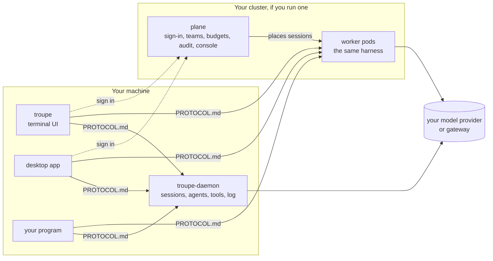
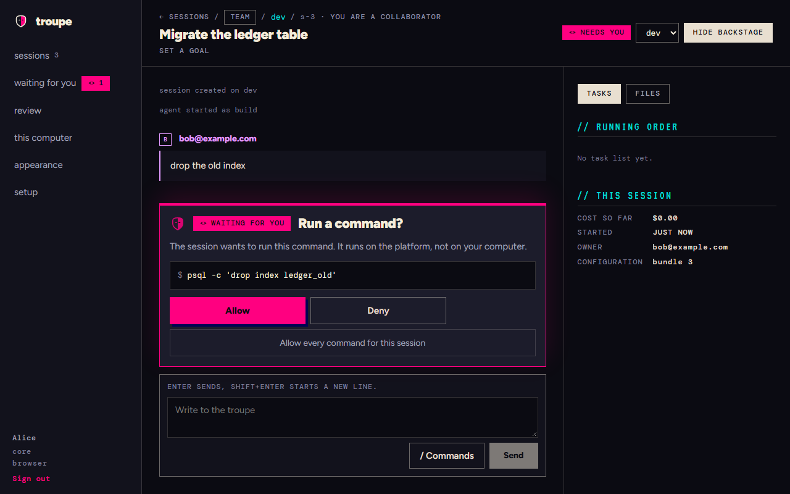

# Troupe

[](https://github.com/it-minds/troupe/actions/workflows/ci.yml?query=branch%3Amain)
[](https://github.com/it-minds/troupe/actions/workflows/quick-start.yml)
[](https://github.com/it-minds/troupe/releases/latest)
[](PROTOCOL.md)
[](LICENSE)

Troupe runs coding agents for you and your team: give one a task in a directory, and it
reads the code, changes it and runs commands there, asking you first before each change
and each command. The work is a [session](docs/glossary.md#session) that lives in a daemon
on your machine or on a pod in your team's Kubernetes cluster, not in the window you
started it from, and every client, ours or yours, reaches it over
[one documented protocol](PROTOCOL.md).





What it is not:

- **A model.** It calls the provider you configure, Anthropic, OpenAI or any
  OpenAI-compatible gateway, with your key, and counts what each call used.
- **A hosted service.** There is nothing to sign up for. It runs on your machine and, if
  you want one, on your cluster.
- **A sandbox on your laptop.** There, commands run as you, once you approve them; on a pod
  they run under bubblewrap, behind a network policy.
- **An editor.** It works beside yours, from a terminal, a desktop app, a browser or your
  own program.
- **1.0.** Releases are betas. [When you do not need it](docs/why-troupe.md#when-you-do-not-need-it)
  has a section of its own.

## Quick start

On Linux or macOS:

<!-- quick-start: sh -->
```sh
curl -fsSLO https://github.com/it-minds/troupe/releases/latest/download/install.sh
sh install.sh --tui
```

On Windows, in PowerShell:

<!-- quick-start: powershell -->
```powershell
irm https://github.com/it-minds/troupe/releases/latest/download/install.ps1 -OutFile install.ps1
powershell -ExecutionPolicy Bypass -File .\install.ps1 -Tui
```

Then, in a new terminal and with your key in `ANTHROPIC_API_KEY` (or none, and it asks),
`troupe config` shows the model it will use and `troupe` in a project directory opens a
session. `--gui` (`-Gui`) adds the desktop app. The [quick start](docs/quick-start.md) is
the ten-minute version: a first session, what it cost, how to cap the next one, and what a
plane adds. CI runs its commands against the latest release every night.

## Where next

| | |
|---|---|
| [Quick start](docs/quick-start.md) | install, a first session, its cost and a cap, in ten minutes |
| [Why Troupe](docs/why-troupe.md) | who it is for, how it compares with an agent CLI on your laptop, what a plane buys, when you do not need it |
| [Glossary](docs/glossary.md) | session, workspace, profile, bundle, plane, worker, daemon, agent, skill, trigger, principal |
| [Using it](docs/user/README.md) | the clients, every setting, what Troupe never does |
| [Running a plane](docs/admin/installing.md) | from an empty Kubernetes cluster to a first team, then [the rest of it](docs/admin/README.md) |
| [Changing it](docs/developer/README.md) | architecture, local setup, tests, builds, releases; [CONTRIBUTING.md](CONTRIBUTING.md) |
| [Writing a client](PROTOCOL.md) | the protocol, complete on its own, with JSON Schema for every message |

This repository is all of it: the platform, the daemon and both clients, with one
`VERSION` and one release ([.github/CI.md](.github/CI.md)). [ARCHITECTURE.md](ARCHITECTURE.md)
is the design and [DECISIONS.md](DECISIONS.md) why it is that way.

## Licence

Apache-2.0: [LICENSE](LICENSE) and [NOTICE](NOTICE). The packages Troupe depends on, and
their licences, are in [docs/third-party-licences.md](docs/third-party-licences.md), and
their licence texts in [THIRD-PARTY-NOTICES.txt](THIRD-PARTY-NOTICES.txt), which every
download and image carries with LICENSE and NOTICE. [SECURITY.md](SECURITY.md) says how to
report a vulnerability privately, and [CODE_OF_CONDUCT.md](CODE_OF_CONDUCT.md) how we
treat each other.

**The name.** The licence grants no rights to the name "Troupe" or to its logo, the mask
(section 6). Use the name to say truthfully what your work is: that it is built on
Troupe, is a fork of it, packages it or works with it. Do not call a fork, a product or a
service "Troupe", or use the name or the mask so that it looks as if the project or its
maintainers made or endorse something they did not. A changed build you give to others
carries a name of its own.
