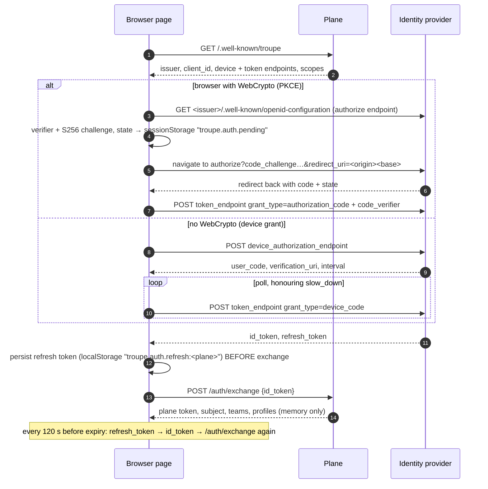
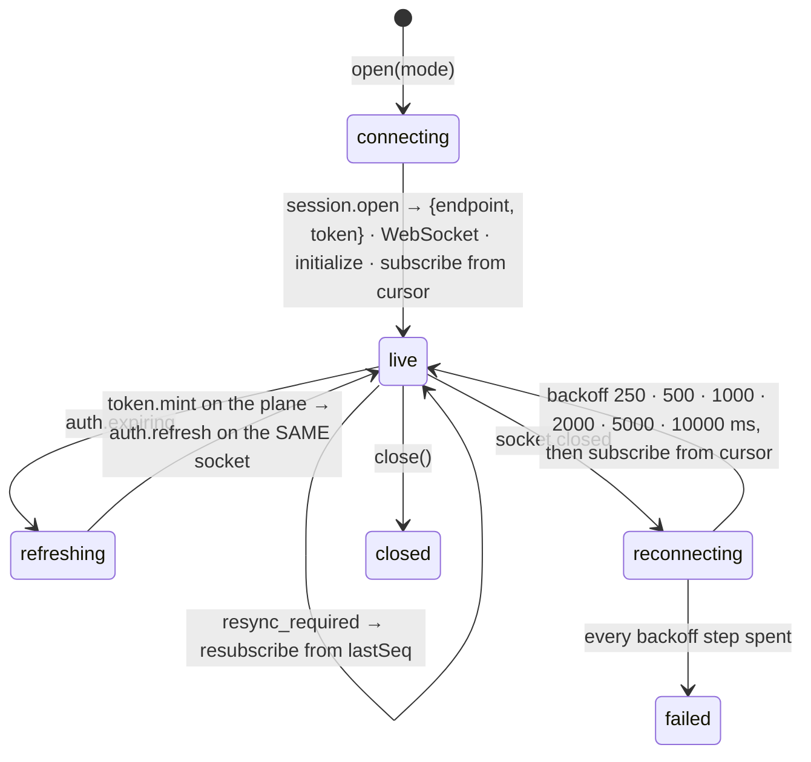

# troupe-gui — a technical deep dive

> Audited against troupe-gui commit `783e660` (branch `master`) plus the uncommitted working
> tree, 2026-09-13. See [AUDIT.md](AUDIT.md) for what could not be confirmed. Companion
> documents: [developer/](developer/README.md), [user/](user/README.md), [admin/](admin/README.md).
> The server this client speaks to is documented in the troupe-remote repository:
> [`../../../docs/whitepaper.md`](../../../docs/whitepaper.md).

This document explains how the GUI is built and why it is shaped the way it is. It cites the
code that decides each behaviour. It does not restate the protocol; `PROTOCOL.md` in the
server repository is normative and the client library follows it.

---

## 1. What it is

A browser client for Troupe. It signs a person in through their identity provider, asks the
plane which sessions they may see, and attaches to a worker pod's WebSocket to read and
steer one session at a time. It holds no session state of its own: every view is a fold over
events it subscribed to, closing the tab loses nothing, and the only secret it persists is the
identity provider's refresh token (`packages/client/src/auth.ts:1-10`).

It is stage 1 of a four-stage plan (`spec.md`): team sessions over the plane. Local sessions
through the daemon on the person's own machine, private sessions sealed under the person's
key, and the review and administration screens are stages 2–4 and are not built
(`REPORT.md:574-582`).

Three packages, one rule: `apps/desktop` imports `@troupe/client` and nothing from the server
repository; `@troupe/client` depends on no framework and has no runtime dependencies
(`packages/client/package.json`); nothing reads a file under `$TROUPE_STATE_HOME`
(`spec.md`, "Boundaries are enforced by the build").

```mermaid
flowchart LR
  subgraph desktop["apps/desktop (Vite + React 19)"]
    App[App.tsx<br/>Where: sessions | approvals | session]
    Hooks[hooks.ts<br/>useFleet · useProfiles · useSessionView]
    Views[views/<br/>SignIn · Sessions · Session<br/>Approval · Approvals · Files · bits]
    Shell[shell.ts<br/>contract for a desktop shell<br/>(no implementation yet)]
  end
  subgraph client["packages/client (@troupe/client, no deps)"]
    Auth[auth.ts AuthSession<br/>device grant · PKCE · restore · renew]
    Pkce[pkce.ts]
    Plane[plane.ts PlaneClient<br/>discovery · /auth/exchange · /rpc]
    Attach[attach.ts SessionAttachment<br/>reconnect · auth.refresh]
    Conn[connection.ts TroupeConnection<br/>WebSocket · JSON-RPC]
    View[session.ts SessionView<br/>cursor · commands · prompt()]
    Fold[transcript.ts<br/>pure fold: events → transcript]
    Fleet[fleet.ts FleetStore<br/>poll · merge · sort]
  end
  App --> Hooks --> Views
  Hooks --> Auth
  Hooks --> Fleet
  Hooks --> Attach
  Auth --> Pkce
  Auth --> Plane
  Attach --> Conn
  Attach --> View
  View --> Conn
  Views --> Fold
  Fleet --> Plane
```

---

## 2. The path a client takes

```
GUI ── GET  /.well-known/troupe ──────────► plane          discovery, no auth
GUI ── authorize (PKCE) or device grant ──► identity provider → id_token, refresh_token
GUI ── POST /auth/exchange {id_token} ────► plane          → plane token (≤ 15 min)
GUI ── POST /rpc sessions.list / session.create / session.open / token.mint ► plane
GUI ── WS   wss://<pod>/v1/socket ────────► worker         initialize → subscribe → input.send → events
```

The plane is never in the data path of a live session. Only the last hop is a socket;
everything before it is ordinary HTTP (`README.md`, "The path a client takes";
`packages/client/src/plane.ts`).

### 2.1 Signing in

`AuthSession` chooses a flow by capability (`auth.ts:193-196`): when `location.href` and
`crypto.subtle` exist — a browser page — it uses the OAuth authorization-code flow with
PKCE; otherwise the OIDC device grant. The device grant is what the CLI uses and what the
spec asked for (`spec.md`, stage 1 "Sign-in"); PKCE was added because Microsoft Entra refuses
the device grant for the SPA-style registration the GUI needs and because a redirect is the
flow a browser is built for (`DECISIONS.md` #20–#21).



Points the diagram compresses:

- The authorize endpoint is taken from the plane's discovery document if it publishes one,
  otherwise from the provider's own OpenID configuration, because the plane does not have
  to be told an authorize URL for the CLI's device grant to work (`pkce.ts:73-87`;
  `DECISIONS.md` #22).
- For a tenant-scoped Microsoft issuer the page sends `domain_hint=organizations` so the
  provider stops offering personal accounts (`pkce.ts:129-200`).
- Code redemption is memoised per code in a module-level map, because React StrictMode runs
  effects twice in development and a PKCE verifier is single-use
  (`pkce.ts:229-262`; `DECISIONS.md` #28). The `code`, `state` and error parameters are
  scrubbed from the address bar afterwards.
- The rotated refresh token is written **before** the exchange, so a failed exchange never
  strands the person with a spent token (`auth.ts:290-299`).
- There is no plane-side refresh. Renewal is always refresh token → id token → exchange,
  triggered when the plane token has under 120 seconds left (`auth.ts:160, 273-281`).
  Sign-out forgets the local credential and refresh token only; the provider's session is its
  own (`auth.ts:262`).
- The only persisted secret is the refresh token, in `localStorage` in a browser or in a
  desktop shell's keychain when one exists (`shell.ts`, `auth.ts:40-64`). Plane tokens and
  pod tokens live in memory.

**Trade-off.** Persisting the refresh token in `localStorage` is what makes "stay signed in
across reloads" possible without a shell, and it is the weakest of the stores
(`auth.ts:40-64` says so). The design accepts it for a browser and defines a keychain
interface for the shell that is not yet built.

### 2.2 One list from a poll

The plane has no push channel to harness clients; `/rpc` is request and answer
(`../../../docs/whitepaper.md`, §6.2). So the fleet is a poll: `PlaneSource`
calls `sessions.list` and `FleetStore` refreshes every 4 seconds from the app
(`packages/client/src/fleet.ts:60-68`, `apps/desktop/src/hooks.ts:18`; `DECISIONS.md` #4).
The store is written for the three sources the spec names — `team`, `local`, `private` —
merged by session id in that order with later kinds winning, sorted pinned-first then by last
activity, and a source that fails keeps its last rows and records the error rather than
emptying the list (`fleet.ts:190-228`; `DECISIONS.md` #5). Only the plane source exists in
stage 1.

### 2.3 Attaching to a session

`SessionAttachment` owns the socket; `SessionView` owns the cursor. That split is the whole
reason a token running out is invisible to the person (`attach.ts`, `session.ts:33-38`;
`DECISIONS.md` #2).


(`attach.ts:38, 105-142`)

The view drops any durable event whose `seq` is not above the last one it processed
(`session.ts:93`), so a resubscribe from the cursor cannot duplicate and the server's closed
boundary cannot leave a gap. While the attachment is reconnecting the view is unbound and a
send throws; the composer restores the draft with an error rather than queuing it
(`attach.ts:141`, `session.ts:65`, `apps/desktop/src/views/Session.tsx:534-536`). The banner
text in the same view promises queuing; [AUDIT.md](AUDIT.md) §2 records the discrepancy.

`useSessionView` opens the attachment in `activate` mode by default and the inbox opens in
`read` mode (`hooks.ts:172`, `views/Approvals.tsx:69`). On a real plane, `read` never wakes a
dormant session and `activate` does; looking at an approval from the inbox therefore costs
nothing, while opening a session from the list starts its actor tree
(`packages/client/src/plane.ts:331`; `DECISIONS.md` #13).

### 2.4 Command ids

Every command id is `c-<6 random bytes hex>-<counter>` (`connection.ts:209`). The server's
idempotency ledger used to be keyed on the id alone, so two GUIs generating `c-1` would have
collided; the random prefix keeps ids unique across clients even though the server has since
started keying on the principal too.

---

## 3. The fold

`transcript.ts` is a pure function from `(state, event)` to `state`, and it is the reason two
clients on one session agree: they run the same fold over the same log. It has no protocol
knowledge beyond event shapes and no React.

| Event | Effect on the transcript |
|---|---|
| `input_queued` / `input_accepted` | adds a pending entry, then reconciles it by `command_id` — this is how an optimistic send becomes a real message without guessing (`transcript.ts`, `addPending` / `dropPending`) |
| `user_input` | a `user` entry |
| `llm_delta` (root agent only, ephemeral) | streaming text or thinking; painted, never stored |
| `llm_response` | an `assistant` entry with the model and, when the gateway said so, cost in micro-units; clears streaming |
| `tool_call_started` / `tool_call_completed` | a `tool` entry; content is text or a blob reference fetched on demand |
| `delegation_started` | a `delegation` entry |
| `approval_requested` / `approval_decided` / `approval_resolved` | an `approval` entry that moves from open to decided, naming who resolved it |
| `todo_updated` | the task list |
| `agent_state` (ephemeral) | per-agent state map, from which "working" and sub-agent status are derived |
| `presence` (ephemeral) | who is here |
| `session_created`, `agent_started`, `profile_switched`, `agent_done`, `llm_error` and other lifecycle types | `system` entries and the profile, bundle version, done reason and error fields |

Costs are summed from `llm_response.gateway.cost_micros`; an absent gateway object means the
cost is unknown and renders as "—", a zero means free — the distinction the protocol asks
readers to keep (`PROTOCOL.md`, "`llm_response.gateway`").

`SessionView.prompt()` turns "send and wait for the turn" into a promise for the bench and
for scripts. A turn ends durably with `agent_done`, `cancelled`, `budget_exhausted` or
`llm_error` from the root agent — or quietly, when a text-only answer leaves the agent idle
with only an *ephemeral* `agent_state`, which may be dropped under load; so after an
`llm_response` with `stop_reason: end_turn` the view also polls `session.get` once
(`session.ts:264-339`). That fallback is a protocol fact the client had to learn empirically
and is worth knowing when writing any other client.

**What the client does not do yet.** It types `prev_hash` but verifies no chain
(`grep prev_hash packages/client/src` finds only the type); verification lives in the test
fake and is deferred to stage 3 by the spec.

---

## 4. The screen

There is no router. `App.tsx` holds `Where` — `sessions`, `approvals`, or `session {id}` —
in component state, and a `SignIn` view until an `AuthSession` exists (`App.tsx:19`). The
rail shows the session count, an amber "Waiting for you" count, who is signed in and where
the secret is kept, a theme toggle, and sign out.

The design system (`docs/design/DESIGN.md`, `docs/design/themes/*.tokens.json` → generated
`tokens.css`) ships three themes from one token contract and carries three rules the code
follows: the theme's reserved colour marks work that has stopped and needs a person and nothing
else may use it; structure comes from hairlines and alignment rather than cards and shadows;
and a status is a dot *and* a word, never colour alone (`views/bits.tsx`, `Pill`). Status
precedence in the list is waiting > read-only > error > running > dormant > queued
(`bits.tsx:44-51`).

Approvals are answered in two places from one component: inline in the session, and from a
global inbox that attaches to each waiting session in `read` mode while it is on screen
(`views/Approval.tsx`, `views/Approvals.tsx`). Keys `A` and `D` answer when focus is not in
an input (`Approval.tsx:94-106`). After another person answers first the panel stays and names
who resolved it, because the server's rule is first answer wins.

Large tool results arrive as blob references and are fetched only when the person asks for
all of it, in ranges the server may shorten (`views/Session.tsx`, `LargeResult`;
`session.ts:233-254`).

---

## 5. Build and delivery

The desktop app is a plain web bundle. `vite.config.ts` takes `TROUPE_GUI_BASE` at build time
and bakes it into the bundle as the base path; `app`, `/app` and `/app/` all normalise to
`/app/` (`apps/desktop/vite.config.ts:16-17`). The Dockerfile builds and **tests** the client
before building the bundle, then serves it from an unprivileged nginx on port 8080 with an SPA
fallback, immutable hashed assets and a `/healthz` (`Dockerfile:43-45`, `docker/nginx.conf`;
`DECISIONS.md` #33). The Helm chart deploys two replicas behind an ingress whose path is
`/app(/|$)(.*)` with a rewrite when the base path is not `/`
(`charts/troupe-gui/templates/ingress.yaml`), so the GUI is served from the plane's own host
under `/app` and is same-origin with it (`DECISIONS.md` #29–#31). The container receives no
environment variables: the client id and endpoints come from the plane's discovery document
and the plane URL from the person or the serving origin (`apps/desktop/src/shell.ts:105-109`).

Two allowlists outside this repository decide whether sign-in works: the plane's
`TROUPE_CORS_ORIGINS` must contain the GUI's origin, and the identity provider must register
the GUI's origin (plus base path) as a single-page-application redirect URI. A browser cannot
tell a page *why* a cross-origin request failed, so the GUI names both possibilities and the
origin to add (`packages/client/src/auth.ts:78-96`, `views/SignIn.tsx`).

**Trade-off.** Baking the base path in means a change of path is a rebuild, not a
configuration change; in exchange the bundle is static, cacheable and needs no runtime
substitution (`DECISIONS.md` #30).

---

## 6. Testing strategy

The test suite runs a deployment that implements the protocol rather than imitating a screen
(`packages/client/test/support/`): a fake identity provider with a device grant that answers
`slow_down` and rotates refresh tokens, a fake plane with exact-match CORS and a `fetch`
wrapper that enforces a browser's same-origin policy in Node, and a fake worker on a real
WebSocket with a hash-chained log, replay from a cursor with a closed boundary, token expiry
with `auth.expiring` and `auth.refresh`, blob range caps and first-answer-wins approvals.
`stage1.test.ts` has one block per done item in the spec; the PKCE, fold and fleet store have
their own files; 33 tests in all. What none of it proves is the server's half — the fakes
encode assumptions about a real plane and pod that only a run against one can confirm
([AUDIT.md](AUDIT.md) §4.2).

---

## 7. Decisions and their costs, collected

| Decision | Bought | Paid | Where |
|---|---|---|---|
| Client library with no dependencies, browser and Node | one protocol implementation for the GUI, the bench and scripts | WebSocket and fetch are injected; no framework conveniences | `packages/client/package.json`, `DECISIONS.md` #6 |
| PKCE in browsers, device grant elsewhere | works with Entra's SPA registration; no client secret in the page | the spec's single flow became two; a desktop shell's flow is unresolved | `DECISIONS.md` #20–#21, [AUDIT.md](AUDIT.md) §3.4 |
| Refresh token in `localStorage` | stay signed in without a shell | weakest store; a keychain waits for the shell | `auth.ts:40-64` |
| Poll `sessions.list` every 4 s | no server change needed | up to 4 s staleness; N tabs are N polls | `DECISIONS.md` #4 |
| Cursor in the view, socket in the attachment | token expiry and reconnects are invisible to a turn | two objects to keep in step | `DECISIONS.md` #2 |
| Pure fold in the client package | two clients agree; testable without React | every event type needs a fold clause before it renders | `transcript.ts` |
| Inbox opens sessions in `read` mode | triage wakes nothing | the list view still opens in `activate` | `DECISIONS.md` #13, [AUDIT.md](AUDIT.md) §2 |
| Base path baked at build; served under the plane's `/app` | same origin as the plane, static bundle | rebuild to move it; ingress rewrite required | `DECISIONS.md` #29–#31 |
| Image build runs the tests | an image cannot be built from a red client | slower image builds | `DECISIONS.md` #33 |
| Generated `tokens.css` from `themes/*.tokens.json` | design and code share one source; three themes cost one component library | a check step, a rule never to hand-edit, and a token added in three places | `DECISIONS.md` #14, #37 |

---

## 8. What is not here yet

From `spec.md` and `REPORT.md`, so nobody looks for it: a desktop shell (Tauri or Electron
undecided) and with it local sessions over the daemon's loopback WebSocket — which the daemon
does not serve yet either; private sessions sealed under the person's key; the Review and
administration screens; pin, grant, review, erase and todo editing, which the client library
can call but no screen offers; file upload; browser tests under Playwright; hash-chain
verification in the client.
