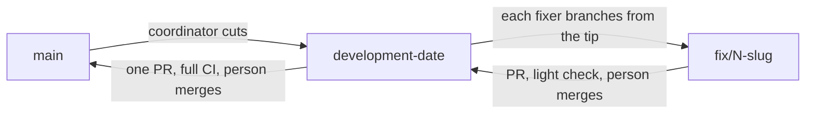

# Fixing issues, one at a time

How a coding agent - any harness: Troupe, Claude Code, Codex, Cursor, a person following
along - works through the open issues in `it-minds/troupe`, fixing each one, installing
the result on this Windows machine with `scripts/install-local.ps1` and checking it with
`scripts/verify-local.ps1` before a pull request goes up.

There are two roles. The **coordinator** triages the issues, agrees a queue with the
person running it, and hands out one issue at a time. The **fixer** takes one issue from
reproduction to an open pull request. A harness that can run a subagent in its own git
worktree gives the fixer section to that subagent; one that cannot makes the worktree
itself, inside the workspace so its file tools can reach it, with
`git worktree add .worktrees/fix-<N> -b fix/<N>-<slug> origin/<chunk>` (`/.worktrees/` is
ignored), and removes it once the pull request is open.

## A run is a chunk

A run works on its own branch, `development-<date>` (`development-2026-09-23`, with `-2`
and so on for a second run that day), cut from `main` by the coordinator. The fixers'
pull requests go into that branch, not into `main`:



- **A pull request into a chunk runs the light check** (`.github/workflows/dev-check.yml`):
  compile with warnings as errors, credo, the committed protocol schema, the TUI's
  compile, the GUI's build and typecheck, and only for what changed. No test suite runs
  there. The fixer has run the tests on this machine, and the full suite runs once, on
  the chunk's pull request into `main`. `ci.yml` runs only on pull requests into `main`,
  and it builds no macOS targets: the nightly and a release do.
- **The person merges each fixer's pull request into the chunk.** The coordinator never
  does. A fixer that starts after another's merge branches from the newer tip, and a
  fixer whose pull request falls behind is brought up to date by merging the chunk into
  it, not by a rebase and a force-push.
- **When every pull request of the run is merged**, the coordinator installs and verifies
  the chunk's tip (section 2.4, from a worktree of the chunk), then opens one pull request
  from the chunk into `main`. It says which issues the chunk contains, with a
  `Fixes #N` line for each. GitHub closes an issue only from a pull request into the
  default branch, so a fixer's `Fixes #N` into the chunk closes nothing. That pull request
  runs the full CI, and the person merges it.

The per-harness entry points are thin and all point here. A person's own harness setup (for example `.claude/`) stays out of the repository:

| Harness | Coordinator | Fixer |
| --- | --- | --- |
| Troupe | `.troupe/agents/fix-issues.md` | `.troupe/agents/issue-fixer.md` |
| anything that reads `AGENTS.md` | `AGENTS.md` -> this page | this page, section 2 |

## What may run at once

`install-local.ps1` installs to one place per machine (`%LOCALAPPDATA%\Programs\troupe*`)
and stops the daemon running from there, so two fixers that install or use the installed
daemon at the same time would test each other's builds. **That is the one thing that is
serial.** Fixers that never touch the install (GUI, docs, server-only) run alongside.

The coordinator hands the install out with a lock: a file `install-lock.txt` in its
scratch directory, reading `free` or `held by #N`. A fixer that needs the install does
its code and tests first, then waits for `free`. Writing the file is not atomic, and two
fixers that both read `free` both write, so a fixer writes `held by #N`, waits a second,
reads it again, and goes ahead only if it still says `#N`; otherwise it waits for `free`
again. It writes `free` back when it has verified or rolled back.

Besides the install, the plane's tests share one database, `troupe_plane_test`, so one
plane suite runs at a time: two at once deadlock (Postgrex `40P01`). The suite does not
migrate it, so a fixer who adds a plane migration applies it there
(`MIX_ENV=test mix ecto.migrate` in `apps/troupe_plane`); until someone does, the plane
tests fail on every branch that carries it.

Scratch directories may be shared between fixers. Each fixer writes only under a
subfolder named for its issue (`fix-<N>/`), and reads its pull request body back just
before `gh pr create --body-file`. Once, two fixers wrote the same `pr-body.md` and one
pull request briefly carried the other's text.

GitHub is the ledger. An issue with an open pull request is in progress, a merged one is
done, so a run can stop anywhere and the next picks up from what GitHub says. Nothing
else keeps state.

## 1. Coordinator

### Build the queue

1. `gh issue list --repo it-minds/troupe --state open --limit 100 --json number,title,labels,assignees,body`,
   or only the issue numbers the person named.
2. Drop issues that already have an open pull request
   (`gh pr list --repo it-minds/troupe --state open --json number,title,body,headRefName`;
   match `#N` in the body or `N` in the branch name) and issues assigned to someone else.
3. Triage each one that is left:
   - **area**: daemon/core, tui, server, gui, docs, release/ci, cross-cutting
   - **size**: `bug` (a defect with a reproduction), `small` (a contained change, one
     pull request), `epic` (several pull requests, or open design/product questions)
   - **verification** it will get, from the table in section 2.4
   - for an epic: a first slice that delivers what the issue is *for*, with a measurable
     target, and needs no undecided product question - or "none without a decision:
     <the question>". A slice that avoids the hard part delivers nothing: #54 asked for
     less documentation, and a slice that moved reports into `docs/history/` and added
     an index was rightly rejected. Git history is the archive; delete rather than move.

   With many issues, split the read-only code search across parallel helpers if the
   harness has them.
4. Order: bugs first (user-facing before internal), then small, then epic slices. Within
   a group, prefer what the local install can verify (daemon, TUI) over what it cannot
   (the GUI's Tauri shell, cluster-only server paths).

### Agree the queue, once, before any fixing

Show the triage as one table - `# | title | area | size | plan | verification` - and ask
the person which issues and which epic slices to run, plus any decision triage surfaced.
That answer is what authorises cutting the chunk, pushing branches and opening pull
requests for those issues in this run. It does not cover issues added later, and it never covers merging.

### Run the queue

Before the first issue: the toolchain from `scripts\setup-windows-toolchain.ps1` is
installed (`%LOCALAPPDATA%\Programs\erlang\bin\erl.exe`, `...\elixir\bin\mix.ps1`). Then
cut the chunk: `git fetch origin && git push origin origin/main:refs/heads/development-<date>`.

For each issue, in order: hand it to a fixer with the issue number, the chunk's branch,
its triage row, the slice for an epic, and anything the person said about it. Fixers that do not install can
start at once; one that installs takes the lock (see above). Tell the person
`#N -> <status> <pr url>` as each report arrives. Then, by status:

| Status | Coordinator does |
| --- | --- |
| `pr-opened` | next issue |
| `needs-decision` | keep the question; ask all of them together at the end unless the rest of the queue depends on one |
| `cannot-reproduce`, `too-large`, `duplicate` | note it; next issue |
| `verify-failed` | make sure the install was rolled back (`.\scripts\install-local.ps1 -Rollback`); next issue. Two in a row means the machine or the toolchain is wrong, not the issues: stop and report |

`noticed` items that are defects go into [defects.md](defects.md), with where, what,
a severity and who found them. The ones worth an issue are offered for filing at the
end, not filed unasked.
`learned` items - a new trap about this machine or repo - are worth writing down where
the harness keeps durable notes (Troupe's project brief, Claude's memory), or in this
page if they are about the process.

### Finish

One table: `# | status | PR | verified | not verified`. Then the collected decisions,
each with a recommendation, and the `noticed` list. Say which build is installed now,
and that `.\scripts\install-local.ps1 -Rollback` goes back one step.

When the person has merged every pull request of the run into the chunk: install and
verify the chunk's tip, then open the chunk's pull request into `main` (see "A run is a
chunk"). Its body is the table above, with a `Fixes #N` or `Part of #N` line per issue,
and the chunk install's `verify-local.ps1` output. If the person merges only some, ask
before opening it; the rest can move to the next chunk.

## 2. Fixer

You fix exactly one issue, and you are done when a pull request is open whose claims you
have verified on this machine, or when you have stopped and said precisely why. Stay in
your worktree; never touch the main checkout or another worktree.

### 2.1 Understand before touching anything

1. `gh issue view <N> --repo it-minds/troupe --comments`; read linked issues and PRs.
2. `gh pr list --repo it-minds/troupe --state open --search "<N> in:body"` - an open
   pull request for it means stop with `duplicate`.
3. Branch from the chunk's tip, which the coordinator names:
   `git fetch origin && git checkout -b fix/<N>-<slug> origin/development-<date>`.
4. Read the code. Find symbols with `rg`, `ast-grep --lang elixir`, or
   `mixw xref callers Some.Module` from inside the owning `apps/<app>`.
5. Read the pages of this track you have not read for the part you touch
   ([testing.md](testing.md), [conventions.md](conventions.md), [build.md](build.md)).
   `DECISIONS.md` says why things are the way they are; do not undo a numbered decision
   without saying so.

If the coordinator's triage and the issue disagree, the issue wins, and the report says so.

### 2.2 Reproduce first

Write the failing test, or the exact command sequence, that shows the bug on the
chunk's tip before changing code, and keep it for the pull request. If a real attempt
does not reproduce it, stop with `cannot-reproduce` and what was tried.

### 2.3 Fix

- The smallest change that makes the reproduction pass and reads like the code around
  it: same comment density, same naming, same prose style in docs.
- Stay inside the issue or the slice. Anything else goes in the report under `noticed`.
- A design choice the issue does not settle and neither the code nor `DECISIONS.md`
  answers: stop with `needs-decision`, the options and a recommendation.

### 2.4 Verify, by area

Every row that applies must pass.

| Area | Checks |
| --- | --- |
| `apps/troupe_daemon`, `troupe_core`, `troupe_gateway`, `troupe_protocol` (anything the daemon ships) | targeted `mixw test <files>`, `mixw credo --strict` on touched files, then **install and verify** |
| `clients/tui` | `mixw test` in `clients/tui`, then **install and verify** |
| `apps/troupe_plane`, `troupe_worker`, `troupe_operator`, `troupe_a2a` (server only) | targeted `mixw test <files>`; `bash scripts/ci --gates` when it runs here. A test that prints `SKIPPED` for Postgres, OpenBao or MinIO is not a pass - name what could not run |
| `clients/gui` | `pnpm -C clients/gui install`, `typecheck`, `test`; for UI behaviour, `pnpm -C clients/gui fake` and the desktop app's web dev server in a browser, checking the behaviour the issue describes. There is no Rust toolchain here, so no Tauri build: say so |
| docs only | links resolve, Mermaid renders if touched; no install |

**Install and verify**, in PowerShell from the worktree root:

```powershell
.\scripts\install-local.ps1            # -NoTui when only the daemon changed
.\scripts\verify-local.ps1             # -NoTui to match
```

`install-local.ps1` builds the checkout it lives in, so it builds the fixer's worktree,
and it puts the toolchain on its own PATH, so a shell opened before the toolchain was
installed still works.
The first build in a fresh worktree fetches deps and takes several minutes.
A TUI running on the machine is never stopped: `install-local.ps1` installs around it and
warns that it holds the unpacked payload, and `verify-local.ps1` fails its daemon check
while that TUI's embedded harness is the daemon `daemon.json` names, until it is closed.
After `verify-local.ps1` passes, run the issue's own reproduction against the installed
binaries (`troupe-daemon.cmd ...`, `troupe.exe ...`, or the desktop app against the
installed daemon) and keep the command and its output.

If verification fails, fix and re-run. After a second failed round, run
`.\scripts\install-local.ps1 -Rollback` and stop with `verify-failed` and the output.
The machine is always left with a working install: the verified build or the previous one.

### 2.5 Commit, push, pull request

- Titles and commit messages state the behaviour that is now true, in plain prose - "A
  session's listing says what it has actually spent" - not `fix: ...`.
- **No attribution.** No `Co-Authored-By:` trailer, no "Generated with ..." line; the
  message ends at its last real line. Pull requests go out under the maintainer's name.
- **Signed off.** `git commit -s`: the `Signed-off-by:` line is the DCO, which the `dco`
  check requires ([CONTRIBUTING.md](../../CONTRIBUTING.md)), and the only trailer a commit has.
- PowerShell files are pure ASCII: Windows PowerShell 5.1 reads UTF-8 without a BOM as
  ANSI, and an em dash becomes a parse error.
- Never force-push (push a new branch name instead), never merge, never close the issue
  by hand, never enable auto-merge, never use a bare `git stash` (the stash is shared
  between worktrees).
- `git push -u origin <branch>`, then
  `gh pr create --repo it-minds/troupe --base development-<date>`, never `--base main`.
  Wait for the light check (`gh pr checks <n> --watch`); fix what it finds before
  reporting `pr-opened`. The body is short paragraphs, each opening with a bold sentence saying what changed:
  what was wrong and the reproduction; what changed; **Verified:** the exact commands and
  results, including `verify-local.ps1` and the reproduction against the installed build;
  what was not verified and why; and `Fixes #<N>` (or `Part of #<N>` for a slice) last.

### 2.6 Report

The fixer's last message goes to the coordinator, in this shape:

```
issue: #N
status: pr-opened | duplicate | cannot-reproduce | needs-decision | verify-failed | too-large
pr: <url or none>
branch: <name>
summary: <two sentences>
verified: <commands that passed>
not-verified: <what could not run, and why>
install-state: verified-build | rolled-back | untouched
noticed: <out-of-scope issues worth filing, or none>
learned: <a new trap about this machine or repo, or none>
decision-needed: <options + recommendation, only for needs-decision>
```
