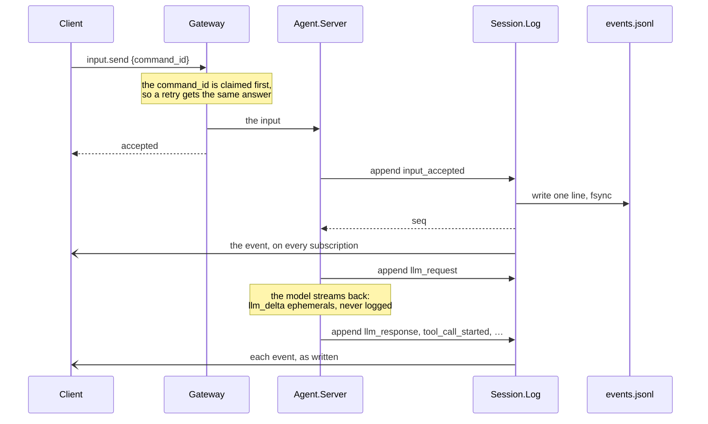

# A tour for contributors

For someone with the repository open who wants to change something. It covers the four
things a first change needs: where things live, running the suite, adding a tool, and how
the event log works. Each part stops where a page of this track takes over, and none of it
is needed to run Troupe: operators have [their own track](../admin/README.md).

## 1. Where things live

One Elixir umbrella under `apps/`, two clients under `clients/`, a Helm chart under
`charts/troupe`, and the documentation. The clients and the plane reach a session only
through the protocol, and `mix troupe.boundaries` fails the build on any other call
([architecture.md §2](architecture.md#2-boundaries)), so the place a change goes is
usually the only place it can go.

| To change | Look in |
|---|---|
| what an agent does in a turn | `apps/troupe_core/lib/troupe/agent/` — `server.ex` is the state machine, `node.ex` its supervisor |
| a tool | `apps/troupe_core/lib/troupe/tools/`, and the list in `tools.ex` (§3 below) |
| a built-in agent | `apps/troupe_core/priv/agents/*.md` |
| the log and replay | `apps/troupe_core/lib/troupe/session/log.ex`, `lib/troupe/log/` (§4 below) |
| a model provider | `apps/troupe_core/lib/troupe/llm/` |
| a command or an event on the wire | `apps/troupe_protocol` (the schema), `apps/troupe_gateway/lib/troupe/gateway/dispatch.ex` (the handlers), and [PROTOCOL.md](../../PROTOCOL.md) |
| the daemon's command line | `apps/troupe_daemon` |
| a worker pod | `apps/troupe_worker` |
| the plane, the console, an admin method | `apps/troupe_plane`: `admin.ex`, `admin/api.ex`, `web/live/` |
| what the operator makes of a profile | `apps/troupe_operator` |
| the terminal client | `clients/tui/lib/troupe/ui/tui/` for the screen, `lib/troupe/remote/` for a plane |
| the graphical client | `clients/gui/apps/desktop/src/views/`, over `clients/gui/packages/client/src/` |
| the chart | `charts/troupe`, its CRDs in `charts/troupe/crds/` |

[repo-structure.md](repo-structure.md) has the whole tree and the generated files, and
[architecture.md](architecture.md) the apps, their supervision trees and where each kind
of state is kept.

## 2. Running the suite

The toolchain is pinned in `.tool-versions`: Elixir 1.20.4 on OTP 28.5.0.5, Zig 0.16.0 for
the `reaper` every shell command runs under, and Node 24 for the GUI. On Windows,
`scripts/setup-windows-toolchain.ps1` installs it. Then, from the root:

```sh
scripts/dev-up                # PostgreSQL, OpenBao and MinIO in Docker, for the suites that need them
mix deps.get
mix check                     # compile --warnings-as-errors, format, credo --strict, boundaries, test
mix test apps/troupe_core/test/troupe/tools/read_tools_test.exs    # one file

(cd clients/tui && mix deps.get && mix check)    # the TUI
(cd clients/gui && pnpm install && pnpm build && pnpm test)    # the GUI
```

`mix check` is the gate a pull request is held to. The core, the gateway and the daemon
need no services; the plane needs PostgreSQL, and the worker and parts of the protocol
need OpenBao and MinIO too. A suite without what it needs says so in a `SKIPPED:` block
naming the command that brings it up, rather than passing quietly
([testing.md §2](testing.md#2-what-each-suite-needs)). No suite needs a model: the `fake`
provider replays a script of steps, one per model call, and records every request, which
is how the harness is tested end to end. [local-setup.md](local-setup.md) has the rest,
including a whole plane on kind.

## 3. Adding a tool

A tool is a module implementing `Troupe.Tool`, in `apps/troupe_core/lib/troupe/tools/`.
`glob.ex` is a short one to copy the shape from.

1. **The five callbacks.** `name/0` is what the model calls. `description/0` is what the
   model reads to choose it, so say when to use it instead of `shell`. `schema/0` is the
   JSON Schema of its arguments. `default_permission/0` is `:auto` for a tool that only
   reads and `:ask` for one that writes or runs anything; an agent definition's
   `permissions:` overrides it. `run/2` gets the arguments and a `%Troupe.Tool.Ctx{}`,
   which is everything a tool may know, and returns `{:ok, content}` or
   `{:error, reason}`.
2. **What the harness already does.** The gate in `Troupe.Tools` checks the allowlist and
   the permission, and asks a person, before `run/2` is called, so a tool never checks
   either. The runner turns a raise, an exit or a timeout into an error result the model
   can read, so a tool does not rescue. An `{:error, reason}` becomes prose through
   `Troupe.Tool.Result.describe/1`: give a new reason a clause there that says what the
   model should do instead.
3. **What a tool must do itself.** Resolve every path with `Troupe.Workspace.resolve/3`,
   so a write never leaves the workspace. Bound the result where it is made — the head
   and tail of output, a window of a file — with a marker naming the exact call that
   returns the rest ([ARCHITECTURE.md §2.3](../../ARCHITECTURE.md#23-tools)). Start any OS
   process with `Troupe.Reaper.open/3`, so it dies with the VM.
4. **Register it** at the end of `@builtins` in `apps/troupe_core/lib/troupe/tools.ex`.
   The order is the order the model sees, and a fixed order is what keeps the provider's
   prompt cache.
5. **Agents.** A definition with a `tools:` list (`explore`, `plan`, `reviewer`) gets the
   tool only if it names it; one without a list gets every tool its `permissions:` do not
   deny.
6. **Test it** in `apps/troupe_core/test/troupe/tools/`, calling `run/2` with a `Ctx` over
   a temporary workspace, as `read_tools_test.exs` does. When it matters what the agent
   does with the result, drive a session with the `fake` provider.

Nothing on the wire changes: a call arrives at every client as `tool_call_started`,
`tool_call_completed` and `tool_results`, whatever the tool. A judgment call a reader
could have made differently goes in [DECISIONS.md](../../DECISIONS.md).

## 4. How the event log works

**The log is the session.** Each session has one `Troupe.Session.Log` process, which owns
one file, `events.jsonl` under the state directory, and is the only thing that writes
durable events. What an agent does, it logs first and acts on second; what a client sees,
it sees because the log published it.



- **Append is a synchronous call, and the file is fsynced before it returns**, so an
  agent never acts on something that was not persisted. One process per session is what
  makes `seq` gapless and the order of the file the order of the session.
- **Each event carries `prev_hash`**, the digest of the event before it in canonical JSON,
  so anyone can check a log from its bytes alone: `Troupe.Protocol.Event.verify/1` in
  Elixir, and the Python conformance client in a few lines of the standard library.
- **Ephemerals** (`llm_delta`, `presence`, `agent_state`, …) have no `seq`, are never
  written and may be dropped under load. Every completed model message is also a durable
  `llm_response`, so nothing a client needs is only ephemeral.
- **Replay.** A crashed agent is restarted by its `Agent.Node` and folds its own events
  back into its state, finishing what it started without running a completed call again.
  A dormant session has no processes at all; the next activating command starts its tree
  and the fold brings it back. A client subscribes from a `seq` and gets the replay, then
  the live events, with no gap and no duplicate.
- **Old logs.** Every event carries a version, and `Troupe.Log.Upcast` brings an old one
  up a step at a time. Each release records logs in `test/fixtures/logs/<version>/` with
  the hash of their fold; `fold_test.exs` replays every version and compares, so a fold
  that quietly changed meaning fails CI. A moving hash is a bug to find, never a fixture
  to re-record.

Adding an event is a recipe in [conventions.md §6](conventions.md#6-recipes), and the
whole wire, with what a client may rely on, is [PROTOCOL.md](../../PROTOCOL.md).

## Where next

[conventions.md](conventions.md) for the gate, commit style and the other recipes (a
command, an admin method, a setting, a GUI view); [fixing-issues.md](fixing-issues.md)
for how issues are worked through; [defects.md](defects.md) before touching code it
names; and [ARCHITECTURE.md](../../ARCHITECTURE.md) for why it is all this way.
