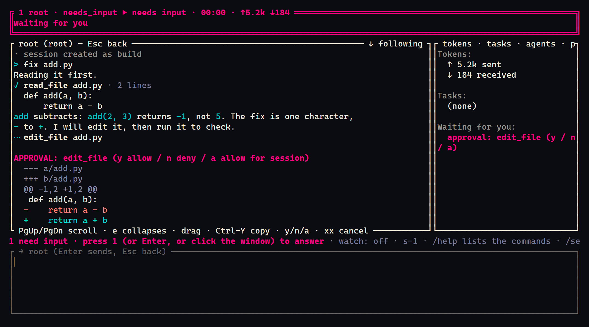

# Quick start

A laptop, ten minutes and a key for a model. By the end of this page you have installed
Troupe, run a [session](glossary.md#session), seen what it spent, capped what the next one
may spend, and know what a [plane](glossary.md#plane) would add. Troupe's own words are in
the [glossary](glossary.md).

The blocks marked for it in this page's source run in CI, on Linux and on Windows, against
the latest release: every night, and on every change to this page
([`quick-start.yml`](../.github/workflows/quick-start.yml)). What CI cannot run is at the
[end](#what-ci-does-not-run).

## 1. Install

On Linux or macOS:

<!-- quick-start: sh -->
```sh
curl -fsSLO https://github.com/it-minds/troupe/releases/latest/download/install.sh
sh install.sh --tui
```

On Windows, in PowerShell:

<!-- quick-start: powershell -->
```powershell
irm https://github.com/it-minds/troupe/releases/latest/download/install.ps1 -OutFile install.ps1
powershell -ExecutionPolicy Bypass -File .\install.ps1 -Tui
```

That installs the latest release's [daemon](glossary.md#daemon), `troupe-daemon`, and its
terminal [client](glossary.md#client), `troupe`, for your user alone: in `~/.local/bin`, or
`%LOCALAPPDATA%\Programs\troupe` on Windows. Every download is checked against the release's
`SHA256SUMS` first, and in a terminal the script shows its plan and asks before it changes
anything; read it before you run it if you like. `--gui` (`-Gui`) adds the desktop app, and
`--vscode` (`-VSCode`) the [VS Code extension](user/vscode.md) where VS Code is. The
programs are not code-signed, and [the TUI's README](../clients/tui/README.md#unsigned-binaries)
says what macOS and Windows make of that.

Open a new terminal, so that the `PATH` the installer set is read, and check:

<!-- quick-start -->
```sh
troupe --version
```

## 2. Bring your own key

Troupe runs no model of its own. It calls the [provider](glossary.md#provider) you name,
with your key, and charges you nothing. The shortest way in is a key in the environment:

```sh
export ANTHROPIC_API_KEY=sk-ant-...     # PowerShell: $env:ANTHROPIC_API_KEY = "sk-ant-..."
```

<!-- quick-start -->
```sh
troupe config
troupe doctor
```

`troupe config` says which provider and model a session will use. With no key anywhere it
asks instead, for Anthropic, OpenAI, a [gateway](glossary.md#gateway) such as LiteLLM, or
your organisation's plane, and writes the answer to `config.yaml`. `troupe doctor` checks
the setup one line at a time: the settings files, the key (by asking the provider for its
list of models, which costs nothing), the helper every command runs under, and the
programs on your `PATH`. `troupe doctor --bench` adds a short run of the harness itself
against a scripted model, offline and in seconds: a turn with tool calls, a cut tool
output, a compaction, a cancel and a replay, each passed or failed with what failed.
Every setting, and which file wins: [configuration.md](user/configuration.md).

## 3. A first session

Make a directory with something wrong in it, and ask about it:

<!-- quick-start: sh -->
```sh
mkdir hello-troupe && cd hello-troupe
printf 'def add(a, b):\n    return a - b\n' > add.py
troupe run plan "Read add.py and say in one sentence what is wrong with it." --headless
```

<!-- quick-start: powershell -->
```powershell
mkdir hello-troupe; cd hello-troupe
Set-Content add.py "def add(a, b):`n    return a - b"
troupe run plan "Read add.py and say in one sentence what is wrong with it." --headless
```

`troupe run` starts a session in this directory, its [workspace](glossary.md#workspace),
and prints what the [agent](glossary.md#agent) does, a line for each event, until it comes
to rest. `plan` is the agent that reads and never writes, so nothing in this run needs you;
the exit code says how it ended ([the codes](../clients/tui/README.md#use)).

Now have it fixed, in the terminal UI:

```sh
troupe
```

Type `fix add.py` and press Enter. Reading is automatic; editing a file and running a
command are not. The agent stops at each and the window asks for an
[approval](glossary.md#approval): `y` allows it, `n` denies it, `a` allows that tool for the
rest of the session. Ctrl-D quits.



With no daemon running on its own, `troupe` runs one inside itself, so the session stopped
when you quit. Its [log](glossary.md#log) is kept, and `troupe resume` opens the session
where it was. To keep
sessions working with no window open, run the daemon on its own, `troupe daemon run` in a
terminal you leave open, `troupe daemon login on` to have it start every time you log in,
or use the desktop app, which starts it; every client on the machine then sees the same
sessions.

## 4. What it cost

Every model call's tokens are in the session's log. The terminal UI shows each window's
tokens sent and received (`↑5.2k ↓184`), and the desktop app shows each session's cost. The
log is JSON, a line an event, under `~/.local/state/troupe/sessions/`
(`%LOCALAPPDATA%\troupe\sessions\` on Windows), and it answers the question by itself. With
`jq`, for every session on this machine, which after this page is two:

<!-- quick-start: sh -->
```sh
cat ~/.local/state/troupe/sessions/*/*/events.jsonl | jq -s '
  [.[] | select(.type == "llm_response") | .data] | {
    model_calls: length,
    input_tokens: (map(.usage.input_tokens // 0) | add),
    output_tokens: (map(.usage.output_tokens // 0) | add),
    cost_usd: ([.[].gateway.cost_micros | numbers]
               | if length == 0 then "not priced" else add / 1000000 end)
  }'
```

A task this small is a couple of model calls and some thousands of input tokens, most of
them the agent's instructions and tool definitions. The nightly CI runs a task like it
against a real model and lists what each run used
([developer/ci.md](developer/ci.md#the-live-check)); a recent one took two calls, about
7,500 input tokens and 50 output tokens. Your model and your task will differ. At $3 per
million input tokens and $15 per million output tokens, figures for the example and not
anybody's price list, that run cost about two cents.

Troupe keeps no price table of its own. A call's cost is what your gateway reports, as
LiteLLM does, or what you tell it the model costs; a provider's own endpoint reports
tokens only, so `cost_usd` above says `not priced` until you write your price into
`config.yaml`:

```yaml
models:
  prices:
    claude-sonnet-5: {input: 3, output: 15}   # dollars per million tokens: your model's price, by the name you use for it
```

## 5. Cap the next one

Every agent has four limits, and the defaults are generous: 40 model calls, 2,000,000 input
tokens, 400,000 output tokens and 30 minutes. At the example prices that is up to $12 of
tokens. The agents a session delegates to draw on its tokens and its time, so those two
limits hold for the whole session; only the model calls are counted per agent. A first
week needs less:

<!-- quick-start: sh -->
```sh
mkdir -p ~/.config/troupe
cat >> ~/.config/troupe/config.yaml <<'EOF'
max_turns: 10
max_input_tokens: 200000
max_output_tokens: 20000
EOF
troupe config --explain max_input_tokens
```

<!-- quick-start: powershell -->
```powershell
New-Item -ItemType Directory -Force "$env:APPDATA\troupe" | Out-Null
Add-Content "$env:APPDATA\troupe\config.yaml" "max_turns: 10`nmax_input_tokens: 200000`nmax_output_tokens: 20000"
troupe config --explain max_input_tokens
```

`--explain` shows the value in force and which file set it. Now a session stops after 10
model calls, 200,000 input tokens or 20,000 output tokens: at most $0.90 at the example
prices. At 80% of any limit the agent is told. At the limit the terminal UI and the desktop
app ask you how much more, for this run, this session or this workspace, or whether to
stop; a headless run has nobody to ask, and stops. Nothing carries on silently.
`troupe --full-send` lifts the limits for one session, and even then a tool that fails ten
times in a row stops the turn and asks. Every [budget](glossary.md#budget) key is in
[configuration.md](user/configuration.md#budget).

What the limits do not count, so that you are not surprised: prompt tokens the provider
serves from its cache, which it bills at a fraction of the input price; a
[branch](glossary.md#branch) you open in the terminal UI, which is a session with limits of
its own; and, the first time you open `troupe` in a git repository, a `librarian` session
that writes the [project brief](glossary.md#project-brief) (`memory_auto_refresh: false`
turns that off).

## 6. What a plane adds

Everything so far ran on your machine and needed nothing else. A plane is the server a team
runs on its Kubernetes cluster, and it adds:

- **Sign-in and [teams](glossary.md#team)** from your identity provider. Nobody has a
  Troupe password, and nobody edits membership in Troupe.
- **Money budgets** per team, per person and for the platform, reserved when a session
  starts and charged with what its calls cost.
- **Sessions on [worker](glossary.md#worker) pods**, which keep working with every laptop
  closed and which a colleague can open with you.
- **[Profiles](glossary.md#profile), [bundles](glossary.md#bundle) and
  [triggers](glossary.md#trigger)**: what a team's sessions run on and carry, and work
  that starts on a schedule.
- **An audit trail** of every administrative change, with its diff, which can say whether it
  has been altered.
- **A [console](glossary.md#console)** at `/admin` for all of it.


With a plane's address from whoever runs it:

```sh
troupe login https://troupe.example.com
troupe --remote
```

`troupe login` signs you in with a code you type in your browser, where you already sign
in. The desktop app lists this machine's sessions and the plane's in one list. Whether you
need a plane at all: [why-troupe.md](why-troupe.md). Running one:
[admin/installing.md](admin/installing.md).

To remove Troupe again: `sh install.sh --uninstall`, or `-Uninstall` on Windows; add
`--purge` (`-Purge`) to remove its settings and session logs too.

## What CI does not run

The job runs every marked block above, in order, as one script: the `sh` ones on Ubuntu
and the `powershell` ones in PowerShell on Windows, from the installers a reader downloads.
It cannot run:

- **your key.** It sets `TROUPE_PROVIDER=fake` instead, a scripted model that answers from a
  file, so every command runs for real and only the model's answer is canned.
- **the terminal UI.** `troupe` needs a person at a terminal; the TUI's own suite draws it
  headless.
- **macOS.** The Linux job runs the same `install.sh`; the macOS builds are smoke-tested
  by `native.yml` nightly and at every release.
- **a plane.** Section 6 is a pointer, not a step.
