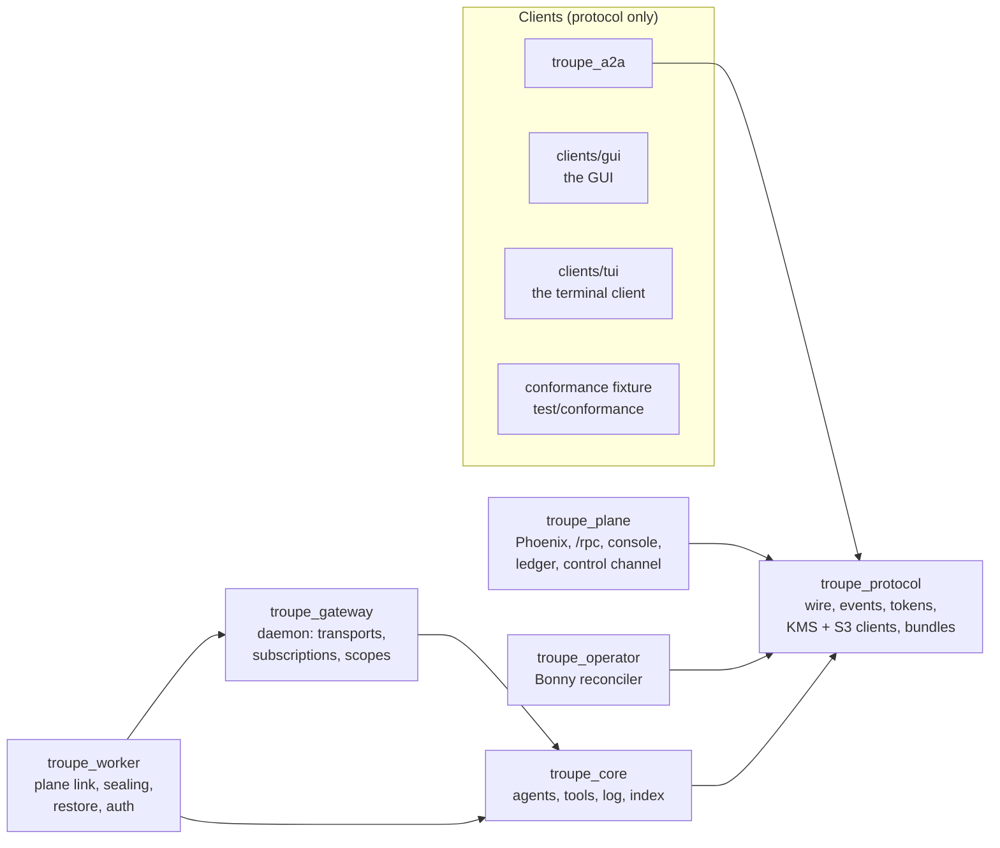
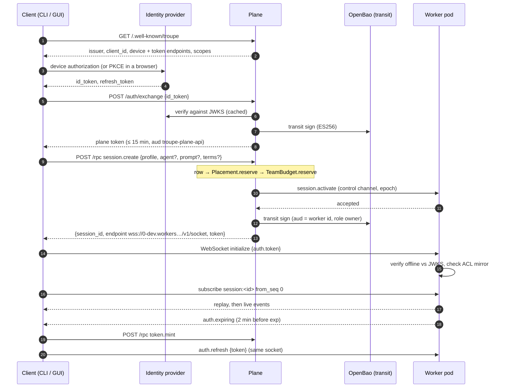
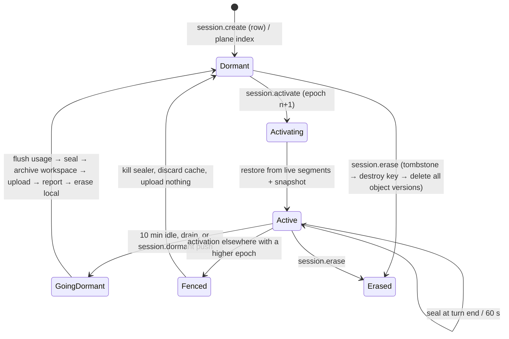
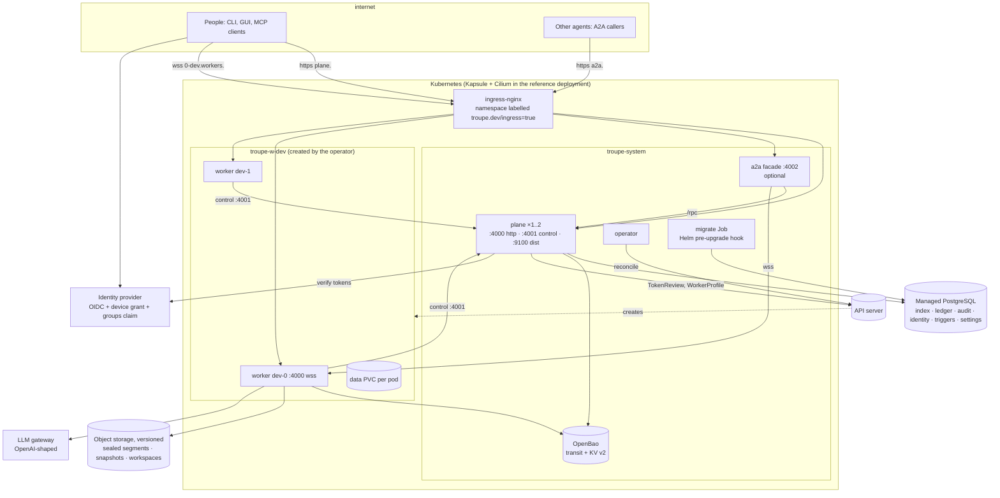

# Troupe Remote — a technical deep dive

> Audited against troupe-remote commit `4083b1f` (branch `main`), 2026-09-13. See [AUDIT.md](history/AUDIT.md) for what could not be
> confirmed. Companion documents: [developer/](developer/README.md), [user/](user/README.md),
> [admin/](admin/README.md).

This document explains how the system is put together and why. It cites the code that
decides each behaviour; where a design document (`ARCHITECTURE.md`, `DECISIONS.md`) is the
best statement of intent it cites that too, and where the two disagree it says which one the
code follows. It does not repeat reference material: environment variables are in
[admin/configuration.md](admin/configuration.md), the protocol in `PROTOCOL.md`, and the
step-by-step procedures in the tracks.

---

## 1. What the system is

Troupe runs coding agents. An agent is a process that talks to a language model, calls tools
(read, edit, search, shell, and tools from MCP servers), and keeps an append-only log of
everything that happened. A **session** is one such agent tree plus its log and workspace. A
**harness** is any client that attaches to a session and speaks the JSON-RPC protocol in
`PROTOCOL.md`: the terminal UI (`clients/tui`), the GUI (`clients/gui`), a Python script, or
the A2A facade acting for another agent — the first two in this repository, and none of
them with any access the others lack.

The codebase has two deployment shapes, and both are built here:

- **Local**: a daemon owns sessions on a person's machine and clients attach over a Unix
  socket or loopback TCP. `troupe_core` and `troupe_gateway` implement it, and
  `apps/troupe_daemon` releases it as `troupe-daemon`, one build per platform; the TUI
  also embeds it when none is running.
- **Remote**: a **plane** (control plane) decides who may use what and where a session runs;
  an **operator** turns a `WorkerProfile` custom resource into a namespace of **worker pods**;
  a worker pod is the same daemon code, reached over a WebSocket with a short-lived token.
  Session content is sealed to object storage under keys the plane cannot read.

The one sentence that organises everything below: **the session log is the session**. Every
client view, every restart and every audit is a fold over an append-only, hash-chained log;
the plane keeps an index of logs, never their content
(`apps/troupe_plane/lib/troupe/plane/repo.ex:5-8`).

---

## 2. The umbrella and its boundaries

Seven Mix applications, four releases — and all four are container images. There was a
fifth release, `troupe`, that packaged a terminal UI and a command line into one
executable per platform; it and its two apps were deleted on 2026-09-14, because this
repository is deployed to Kubernetes rather than installed on a machine. Every client is
now outside it.



The arrows are the only permitted compile-time dependencies. They are not a convention;
`mix troupe.boundaries` reads the compiled BEAM files' import chunks and fails the build on
any other edge (`apps/troupe_core/lib/mix/tasks/troupe.boundaries.ex:29-51`). Three rules
carry the design:

1. **Clients depend on `troupe_protocol` and nothing else.** The TUI and CLI cannot reach
   into `Troupe.Sessions`; whatever they can do, a third-party client can do, because there is
   no other door. The A2A facade is held to the same rule.
2. **The plane never depends on `troupe_core`.** It knows *that* a session exists and who may
   see it; it never runs an agent and never holds session content.
3. **The operator depends on neither.** It holds cluster privileges and has no public
   surface. Compromising the internet-facing plane yields requests that still have to pass
   policy, not a cluster (`ARCHITECTURE.md:44-60`).

A fourth, module-level rule keeps the admin console honest: `Troupe.Plane.Web.Live.*` may
call only `Troupe.Plane.Admin` among the plane's modules
(`troupe.boundaries.ex:48-51`), so a LiveView cannot grow a private path that the JSON-RPC
and MCP surfaces lack.

Releases: `troupe_worker` (core + protocol + gateway + worker), `troupe_plane`,
`troupe_operator`, `troupe_a2a`. One `docker/Dockerfile` builds all four images from a
`RELEASE` build argument; only the worker image carries `git` and `bubblewrap`, and only
the worker image carries Zig, which builds the reaper it is then checked for.

**Trade-off.** Mechanical boundaries cost a custom Mix task and occasional friction (a helper
that would be convenient to share between the plane and the operator has to live in
`troupe_protocol`, which is why that app now holds the KMS client, the S3 client and CRD
parsing despite `ARCHITECTURE.md:23` still calling it "no I/O beyond a socket"). What it buys
is that the protocol document stays true: the built-in clients are proven, every CI run, to
have no privileged access.

---

## 3. The event log

### 3.1 Shape

Every durable event carries `seq`, `prev_hash`, `ts`, `actor`, `agent` (a path such as
`["root", "explore#1"]`), `type`, `v` and `data` (`PROTOCOL.md:145-173`). The hash chains each
event to the previous one over canonical JSON — keys sorted by code point, no insignificant
whitespace — computed over the event *without* its own `prev_hash`
(`apps/troupe_protocol/lib/troupe/protocol/event.ex`, `canonical.ex`). A client can therefore
verify the history it was handed without trusting the server that handed it over;
the Python conformance client does exactly that
(`apps/troupe_gateway/test/conformance/conformance.py`), as did the `troupe verify`
command before the CLI moved out.

`Troupe.Session.Log` is a process per session that appends to `events.jsonl`, calls
`:file.sync` before replying, publishes the event it just wrote, and hands it to the usage
fold (`apps/troupe_core/lib/troupe/session/log.ex:227-235`). It is the **only** publisher of
durable events (`DECISIONS.md` #7); agents publish ephemerals and nothing else. Without that
rule a subscriber sees each fact twice in two slightly different shapes, and the difference
only shows up under replay.

Ephemeral events (`llm_delta`, `agent_state`, `presence`, `summary_diff`, `watch_notice`)
have no `seq`, are never persisted, and may be dropped. Every completed model message also
lands as a durable `llm_response`, so dropping deltas loses smoothness and nothing else.

### 3.2 Replay is the recovery mechanism

An agent is a `gen_statem` (`apps/troupe_core/lib/troupe/agent/server.ex`) whose state is a
fold over its own events: on start it seeds its task only when its log is empty, otherwise it
replays `user_input`, `llm_response`, `tool_results`, `todo_updated`, `profile_switched`,
`compacted` and `agent_done` (`server.ex:165-254`). A crashed agent inside a live session
rebuilds itself and finishes what it started. A session whose whole tree died mid-turn comes
back **interrupted**: it makes no model call until an activating command arrives, and its
unfinished tool calls are closed off as errors naming the interruption
(`server.ex:291-318`). `resume_on_restart: true` opts back in. The reason is money and side
effects: a crash loop that resumed would spend tokens and re-run shell commands nobody is
watching (`DECISIONS.md` #25).

### 3.3 Reading old logs

Every event carries a schema version. `Troupe.Log.Upcast` brings an old one up a step at a
time and may add or rename but never drop (`apps/troupe_core/lib/troupe/log/upcast.ex`;
`DECISIONS.md` #140). The chain is not recomputed: `prev_hash` covers the bytes as written.
Each release records fixture logs under `test/fixtures/logs/<version>/` with the fold each
produces, hashed over a *witness* of the durable types the replay acts on
(`apps/troupe_core/lib/troupe/log/fold.ex:61-69`), and a test reads the replay clauses out of
the source to assert the witness still covers them.

**Trade-off.** Event sourcing makes every client a projection and every restart a replay,
at the cost of a compatibility discipline (`mix troupe.schema.diff` fails CI on a removed,
renamed or retyped field; `PROTOCOL.md:814-828`) and of blob handling for large payloads
(anything over 16 KiB becomes a content-addressed reference fetched with `blob.get`,
deduplicated within a session only so one session's storage is never a probe for another's;
`apps/troupe_core/lib/troupe/session/blobs.ex`, `DECISIONS.md` #34).

---

## 4. Sessions and agents (troupe_core)

Supervision, per session (`apps/troupe_core/lib/troupe/session.ex:54-88`), `rest_for_one`:

```
Troupe.Session
├── Session.Log            the log; its lifetime is the session's
├── Session.Approvals      pending approvals, first answer wins
├── Session.ClientTools    tools a connected client offered, under consent
├── LLM.Fake               only for provider: fake
├── Agent.Node (root)      Task.Supervisor + children DynamicSupervisor + Agent.Server
├── Session.Watcher        watch mode
├── Session.Files          fs_changed events
└── Session.Summary        the throttled summary projection, last on purpose
```

Everything an agent does is a process: each model request runs as a task with a timer, each
tool call is a task with a timeout (`server.ex:739-778, 941-965, 1026`), each subagent is a
child `Agent.Node` under the parent's `DynamicSupervisor` (`server.ex:1172`), and every OS
process runs under `reaper`, a small Zig program owned by a pipe so that killing the VM kills
everything it started (`native/reaper/reaper.zig`, `apps/troupe_core/lib/troupe/reaper.ex`).
Failure is handled by supervision rather than by defensive code.

**Tools** are modules or values implementing `Troupe.Tool`
(`apps/troupe_core/lib/troupe/tool.ex`). Authorisation happens before anything runs: an
unknown tool, one outside the agent definition's allowlist, or one whose permission is `deny`
is refused (`apps/troupe_core/lib/troupe/tools.ex`); `ask` blocks the tool's task on an
approval, not the agent. Built-in permissions: read, list, grep, todo, delegate, finish and
skill are automatic; write, edit, shell, publish and import ask by default; MCP tools take the
server's declared permission, `ask` unless the bundle says otherwise
(`apps/troupe_core/lib/troupe/mcp/tool.ex`).

**Agent definitions** are markdown with YAML frontmatter, loaded lowest to highest
precedence from `priv/agents/` (built-ins `build`, `plan`, `general`, `explore`), the
profile's bundle, the config directory and the workspace's `.troupe/agents/`
(`apps/troupe_core/lib/troupe/agent/definitions.ex:33-38`).

**Budgets** are per agent — turns, input and output tokens, wall clock — checked before every
request, and sliced by `budget_share` when delegating (`apps/troupe_core/lib/troupe/budget.ex`).
Exhaustion produces `budget_exhausted` and `agent_done{reason: budget_exhausted}`; a subagent
returns a partial result to its parent rather than nothing (`server.ex:1255-1272`).

**Compaction** triggers when the last request's input tokens pass `context_window ×
compact_at`; the last six messages are kept and the rest summarised by `small_model` or the
model itself, with the whole replacement conversation logged as `compacted` so replay is
faithful (`server.ex:1299-1401`).

**Watch mode** reads comment markers `AI!` (act), `AI?` (answer read-only under `plan`) and
bare `AI` (context for the next trigger) from saved files, using inotify or a polling
backend, and ignores the agent's own writes by content hash
(`apps/troupe_core/lib/troupe/watch/marker.ex:123-148`, `watch.ex`).

**Sandbox.** On a pod, `shell` runs under bubblewrap with the session's mount table as the
bind list — the same table the file tools check — when `sandbox: :auto` finds bubblewrap
*and* non-session mounts (`apps/troupe_core/lib/troupe/sandbox.ex:44-131`; `DECISIONS.md`
#102). Today a restored pod session has no team mounts (§7.5), so `:auto` does not engage;
this is recorded in [AUDIT.md](history/AUDIT.md) §3.2 and §4.11.

---

## 5. The daemon (troupe_gateway)

```
Troupe.Gateway.Daemon (rest_for_one)
├── Gateway.Commands      idempotency ledger: {subject, command_id} → ack, 30 min
├── Gateway.Connections   DynamicSupervisor, one Connection per client (max 256)
├── Gateway.Listener      Unix socket 0600 | loopback TCP + token file | remote
└── Gateway.Idle          stops the daemon after 10 min with nothing to do
```
(`apps/troupe_gateway/lib/troupe/gateway/daemon.ex`, `listener.ex`, `idle.ex`)

Sessions are deliberately **not** in this tree; they live in `Troupe.Application`, so the
daemon can lose every connection without disturbing an agent (`ARCHITECTURE.md:78-84`).

Three ideas make several clients on one session coherent:

- **A command is an acknowledgement, never an effect** (`PROTOCOL.md:332-336`). `input.send`
  returns `{accepted: true}`; what happened arrives as events carrying the `command_id`, so
  every client learns it the same way, from the log. `Gateway.Commands` claims the id
  *before* running the command, so a retry after a disconnect returns the same answer and
  never a second effect (`apps/troupe_gateway/lib/troupe/gateway/commands.ex`).
- **Subscriptions replay then follow live, with no gap and no duplicate at the boundary.**
  The connection holds the cursor, so the switch is one decision in one process
  (`apps/troupe_gateway/lib/troupe/gateway/dispatch.ex:245-276`).
- **Backpressure has two budgets.** Ephemerals are dropped once a client has more than
  4 MiB outstanding; durable events are never dropped for memory — they are counted, and past
  10 000 queued the subscription ends with `resync_required` and the last `seq` delivered
  (`apps/troupe_gateway/lib/troupe/gateway/connection.ex:625-731`). Each connection owns a
  `Writer` process so that a blocking `:gen_tcp.send/2` cannot stop the connection's own
  logic from running (`writer.ex`; `DECISIONS.md` #21-#24).

Scopes `observe` < `control` < `admin` are checked per method in `Dispatch`
(`dispatch.ex:41-74`). Locally the socket's permissions grant all three.

**Worktrees**: a second live session in a git workspace gets its own worktree on
`troupe/<slug>` so two agents never see each other's half-finished edits as the user's
(`apps/troupe_gateway/lib/troupe/gateway/worktrees.ex:25-35`).

The same gateway code serves a worker pod with a third endpoint kind whose authenticator is
a signed token and whose guard is the ACL mirror (`ARCHITECTURE.md:534-538`), which is what
keeps the local and remote protocol implementations from drifting apart.

---

## 6. The plane (troupe_plane)

The plane decides *what* may happen and *where*; it never sees what happens. Two surfaces,
one rule: no session content crosses either of them.

### 6.1 Identity

Troupe is a plain OIDC relying party. Clients run the device grant against the provider
named in `GET /.well-known/troupe`; the plane never sees a password
(`apps/troupe_plane/lib/troupe/plane/web/router.ex:63-77`). `POST /auth/exchange` verifies
the provider's id token against its published keys and mints a **plane token**: ES256,
signed through OpenBao's transit engine so the plane holds no private key it could leak,
`kid` the RFC 7638 thumbprint, lifetime at most 15 minutes
(`apps/troupe_plane/lib/troupe/plane/tokens.ex:28-62, 119-146`;
`DECISIONS.md` #79-#81). A user's groups arrive as a token claim named by `groups_claim`;
memberships are replaced on every login and never edited in Troupe
(`apps/troupe_plane/lib/troupe/plane/login.ex:28-71`). The console uses the authorization-code
flow with a client secret at `<base_url>/admin/callback`
(`apps/troupe_plane/lib/troupe/plane/web/admin_auth.ex:128-169`).

Two roles. `platform_admin` is membership of an identity-provider group named in
configuration — never assigned in Troupe, because an admin role Troupe could grant would be
a way to escalate inside Troupe. `team_admin` is the one role Troupe assigns, per team
(`apps/troupe_plane/lib/troupe/plane/admin.ex:55-95`; `DECISIONS.md` #154). Neither reads
session content: there is no admin method that returns events. **Service principals**
(`svc:<team>/<name>`, a salted hash of a secret shown once) are how a trigger or another
agent is a caller and not a feature; they get no admin role at all
(`apps/troupe_plane/lib/troupe/plane/principals.ex`).

Break-glass is a separate, audited console login with a configured token that lasts an hour
and acts as a platform admin with no teams; when no token is configured its routes answer 404
(`apps/troupe_plane/lib/troupe/plane/breakglass.ex`). The design documents use the word
"break-glass" for two different things — this login, and (as something that does not exist)
access to session content — which [AUDIT.md](history/AUDIT.md) §2 notes.

### 6.2 The harness API

Everything a client needs from the plane is `POST /rpc`: `me`, `teams.list`,
`profiles.list`, `sessions.list`, `session.get`, `session.open`, `session.create`,
`token.mint`, `session.pin/unpin/erase`, `session.grant`, `session.review`, `trigger.fire`
(`apps/troupe_plane/lib/troupe/plane/harness.ex:49-64`). It is a fleet API: it lists what you
may use and hands you an endpoint and a token for a pod. Detail streams go straight to the
worker, which keeps the plane out of the data path of every live session.

`session.create` is a sequence of reservations, each given back if a later one fails:

```
validate → row → capacity (Placement actor) → budget (TeamBudget actor) → push session.activate → mint token
```
(`harness.ex:147-167`; the moduledoc at `harness.ex:18` lists an older order.) The row comes
first because a placement is a conditional write against it, which is what makes a placement
survive the replica that made it (`DECISIONS.md` #85). `Placement` and `TeamBudget` are one
process per profile and per team, registered with `:global`, so capacity and budget are
decided by an actor rather than a lock (`apps/troupe_plane/lib/troupe/plane/placement.ex`,
`team_budget.ex`, `singleton.ex`; `DECISIONS.md` #44). That is also why two plane replicas
must form an Erlang cluster: the chart refuses `replicas > 1` with `distribution: none`,
because unclustered replicas are two planes each placing as if alone
(`charts/troupe/templates/_helpers.tpl:31-35`, `config/runtime.exs:283-309`).

`session.open` in `read` mode never activates a session; a session that woke up because
somebody looked at it would never stay dormant. In `activate` mode a conditional epoch bump
is the decision: exactly one caller wins, places the session and pushes it to a pod
(`apps/troupe_plane/lib/troupe/plane/sessions.ex:119-137`).

### 6.3 The control channel

Workers dial a raw TCP listener on port 4001 that is never exposed through ingress
(`apps/troupe_plane/lib/troupe/plane/control/listener.ex`). The first message must be
`enrol`, carrying the pod's projected ServiceAccount token; the plane validates it with a
Kubernetes `TokenReview` and **the namespace decides the profile**, so a pod can only enrol
as what it is (`apps/troupe_plane/lib/troupe/plane/enrolment.ex:24-25, 46-63`). Over the
channel flow heartbeats, the session *index* (ids, epochs, sequence numbers, head hashes,
byte counts), status columns and usage batches upward; and idempotent pushes downward —
`session.activate`, `session.read`, `acl.changed`, `drain`, `session.erase`,
`config.updated`, `jwks.updated`
(`apps/troupe_plane/lib/troupe/plane/control/connection.ex:238-391`). A pod is attached to
one replica, so pushes are routed: try locally, else ask the other replicas over `:erpc`
(`control/router.ex:20-49`).

### 6.4 Tokens for pods

A pod token's `aud` is **the pod's worker id**, not the profile and not the plane
(`ARCHITECTURE.md:480-486`). A profile has many pods and an audience naming the profile would
make them interchangeable, which is exactly what a leaked token wants. Workers verify offline
against a cached JWKS pushed at enrolment, warn with `auth.expiring` two minutes out, and
accept `auth.refresh` on the connection that is already open
(`apps/troupe_worker/lib/troupe/worker/auth.ex:186-191`,
`apps/troupe_gateway/lib/troupe/gateway/connection.ex:475-498`). The role in a token is a
claim about the moment it was minted; access is checked again on every command against the
ACL mirror the plane pushes, so a revoked collaborator is refused on their next command
(`auth.ex:203-215`; `DECISIONS.md` #83).



### 6.5 Provisioning, policy and the console

Administration is one context, `Troupe.Plane.Admin`, rendered four ways: the LiveView
console, `admin.*` methods on `/rpc`, `troupe admin`, and an MCP server at `POST /mcp` whose
tools are the same method table with the dots replaced by underscores
(`apps/troupe_plane/lib/troupe/plane/admin/api.ex`, `admin/mcp.ex:211-216`). A parity test
fails a context function missing from any rendering, and the method table carries a summary
and typed arguments because for a model the description *is* the interface. A destructive
tool must repeat the identifier in a `confirm` argument (`admin/mcp.ex:147-165`).

`/mcp` accepts two kinds of bearer token: a plane token (bridged over stdio by `troupe mcp`)
and the identity provider's own token, audience `client_id`, `api://<client_id>` or `<base_url>/mcp`, because a
remote MCP client does OAuth against the provider and has no step at which it could obtain a
plane token (`apps/troupe_plane/lib/troupe/plane/oidc.ex:88-120`). Troupe is a resource
server, never an authorization server (`router.ex:294-338`, RFC 9728 document).

The plane writes exactly one kind of cluster resource, `WorkerProfile`, by server-side apply
in `direct` mode or as a commit to a git checkout in `gitops` mode
(`apps/troupe_plane/lib/troupe/plane/provision.ex:135-149, 204-216, 256-316`). Its Role allows
`workerprofiles` and `teamvolumes` in `troupe-system`, `troupepolicies` read, and
`TokenReview` (`charts/troupe/templates/plane-rbac.yaml`). The plane validates a profile
against `TroupePolicy` for fast feedback, but admission and the operator remain authoritative
(`ARCHITECTURE.md:686-690`). **Caveat**: nothing in `config/` sets the `:k8s_conn` this code
reads, so a deployed plane in `direct` mode answers `state: not_applied, reason: no_cluster`
until that is resolved ([AUDIT.md](history/AUDIT.md) §3.1).

**Platform settings** (`Troupe.Plane.Settings`) are an *override* over the deployment, never
a replacement: a stored row wins, absent means the environment variable, and reset deletes
the row. Anything that could shut the console — issuer, client id, audience — is read-only.
The failure this repairs is a `platform_admin_group` nobody is in: it can be changed from
behind the break-glass login, and the field refuses to save until an identity check has
passed for the value in the field (`apps/troupe_plane/lib/troupe/plane/settings.ex:49-216`,
`web/live/settings.ex:35-40`).

Every administrative change writes an audit row with the actor and a path-keyed diff
(`spec.llm.model`, not `spec`), computed by the same function the editor previews with, so
what the form promised and what the trail says cannot differ
(`apps/troupe_plane/lib/troupe/plane/audit.ex:70-98`).

---

## 7. A worker pod (troupe_worker)

### 7.1 One process per active session, none per dormant one

A pod is expected to be responsible for tens of thousands of sessions with almost all of them
asleep, so dormancy stops the session's manager rather than parking it
(`apps/troupe_worker/lib/troupe/worker/session/manager.ex`). Everything a dormant session
*is* lives in object storage, and activation is the only path back — which makes relocation
and PVC loss the same operation.

### 7.2 Sealing

A sealer per active session keeps the durable events and uploads an encrypted segment at
every root-agent turn end and at least every sixty seconds while anything is pending
(`apps/troupe_worker/lib/troupe/worker/session/sealer.ex`). That interval is the durability
promise: losing a pod's disk costs the unsealed tail and nothing more. **Upload, then
report**: a segment the plane has been told about but that is not in storage would let a
rebuild claim history it cannot produce; the reverse is merely un-anchored until the next
report (`DECISIONS.md` #66).

Segments are AES-256-GCM with the session id as associated data, under a per-session key
created in OpenBao KV v2 at `troupe/teams/<team>/sessions/<id>` by the pod
(`apps/troupe_protocol/lib/troupe/sessions/cipher.ex`, `kms/open_bao.ex`). The manifest is
plaintext and holds identifiers only. The plane's OpenBao policy can destroy key metadata
and read no key at all — not a deny rule, an absence (`apps/troupe_protocol/lib/troupe/kms/policy.ex`;
`docs/deploying-on-scaleway.md:46-52`).

Object layout: `sessions/<id>/{manifest.json, segments/<epoch>-<first>-<last>.seg,
snapshots/<seq>.snap, workspace/<seq>.<ext>, blobs/<sha>}`
(`apps/troupe_protocol/lib/troupe/sessions/storage.ex`).

### 7.3 Dormancy, fencing, erasure


(`manager.ex:330-378`, `apps/troupe_worker/lib/troupe/worker/plane/commands.ex`,
`apps/troupe_plane/lib/troupe/plane/erasure.ex:53-113`)

Epochs are minted by the plane alone. A pod whose epoch has been passed refuses to activate,
checked against the plaintext manifest before anything is decrypted; a running session that
is fenced kills its sealer and discards its cache (`ARCHITECTURE.md:528-530`). Erasure
destroys the key **first**: once it is gone nothing under the prefix decrypts — not the
current objects, not prior versions a versioned bucket keeps, not a backup — so the deletion
that follows is tidiness rather than the security property. The plane drives erasure but
cannot perform it; it holds no key-reading credential and no object-store credential, so it
asks a healthy pod of the profile, and a pod that was offline applies pending erasures on
enrol (`DECISIONS.md` #89-#90). Bucket versioning must therefore be *on*: without it,
`session.erase` succeeds vacuously (`docs/deploying-on-scaleway.md:71-76`).

### 7.4 Draining and disk

Scaling down, restarting for a new image and an admin drain are one sequence: the plane marks
the pod draining in the database so every replica stops placing on it, the worker waits for
running turns up to the drain timeout (also the pod's `terminationGracePeriodSeconds`),
cancels what remains, and the plane checks its own index before agreeing the pod is empty
(`apps/troupe_plane/lib/troupe/plane/drain.ex:33-72`, `apps/troupe_worker/lib/troupe/worker/drain.ex`).
Disk pressure evicts least-recently-used caches of non-active sessions above a 70 % watermark
and never an active workspace, the only copy of work in progress
(`apps/troupe_worker/lib/troupe/worker/disk/watch.ex:106-140`; `DECISIONS.md` #100).

### 7.5 Mounts

A session's file tools, `fs.*` commands and the sandbox all resolve paths through one mount
table (`session:/`, `team:<name>/`, `org:/`, `skills:/`) recorded as `mounts_resolved`
(`apps/troupe_core/lib/troupe/mounts.ex`). The operator mounts team volumes at
`/mnt/teams/<name>`; the worker's restore path does not yet pass them into the session
([AUDIT.md](history/AUDIT.md) §3.2), so `publish` and `import` — the only tools that cross mounts —
have nowhere to go on a pod today.

---

## 8. The operator (troupe_operator)

Three custom resources, three owners (`charts/troupe/crds/`): `TroupePolicy` (cluster-scoped,
written by a cluster admin, never the plane) says what any profile may ask for;
`WorkerProfile` (in `troupe-system`, written by the plane) says what one pool of workers
should be; `TeamVolume` says a team has shared storage. `WorkerProfile.spec.teams` is a
projection of the plane's grants, not a second source of truth.

Policy is checked twice on purpose: a `ValidatingAdmissionPolicy` in CEL refuses a profile
outside policy at the API server, and the operator checks again and marks `PolicyViolation`
without creating anything (`charts/troupe/templates/admission-policy.yaml`,
`apps/troupe_operator/lib/troupe/operator/reconciler.ex:106-118`). Admission is the check that
gives a person an error now; the operator's is the one that still holds when admission is
unavailable or the policy tightened afterwards. (The two lists differ on one field:
admission also checks `spec.storage.storageClassName`; `apps/troupe_protocol/lib/troupe/policy.ex:171-178`
checks team volumes only.)

`Troupe.Operator.Resources.for_profile/3` is a **pure function** from a profile, a policy and
settings to the manifests that profile implies, so naming, addressing and egress are tested
without a cluster (`apps/troupe_operator/lib/troupe/operator/resources.ex:22-38`,
`test/troupe/operator/resources_test.exs`). For profile `dev`:

| Object | Name | Why |
|---|---|---|
| Namespace | `troupe-w-dev`, label `troupe.dev/workers=true` | the plane's NetworkPolicy admits the control port from this label |
| ServiceAccount | `troupe-worker`, no automount | the pod gets two *projected* tokens instead, audiences `troupe-plane` and `troupe-kms`, so neither can be replayed against the API server |
| StatefulSet | `troupe-w-dev`, `OnDelete`, one `data` PVC per pod | a pod holds live sessions; rolling it would kill work in progress, so upgrades wait for a drain |
| Service + Ingress per pod | `dev-0`, host `0-dev.workers.<domain>` | a client dials the pod directly; the hyphen keeps every pod under one DNS label so one wildcard covers every profile (`names.ex:50`, `config/runtime.exs:52-59`) |
| NetworkPolicy | default-deny; ingress only from namespaces labelled `troupe.dev/ingress=true`; egress to DNS, the plane's control port, OpenBao, object storage, and the public internet on 80/443 minus private ranges | standard policy cannot name an FQDN, so the LLM and MCP hosts degrade to a CIDR rule — a documented gap |
| CiliumNetworkPolicy | `toFQDNs` for the six destinations | the rule the profile actually asked for, where Cilium exists |
| PodDisruptionBudget, PVCs `team-<name>`, `org` | | |

(`resources.ex:65-476`)

Reconciliation is level-triggered and idempotent: read the world, compute what should exist,
apply the difference with server-side apply, prune managed objects no longer implied (by
label, not owner reference, because owner references cannot cross namespaces;
`DECISIONS.md` #39). Leadership is a Kubernetes `Lease`. The operator writes conditions
`Ready`, `PolicyViolation`, `SecretMissing`, `UpgradePending`
(`reconciler.ex:152-257`). It never deletes a pod; an `OnDelete` upgrade is reported, not
performed ([AUDIT.md](history/AUDIT.md) §3.13). The `SecretMissing` check reads `troupe-system`
while pods resolve their `secretKeyRef` in their own namespace, and the operator's ClusterRole
grants no verb on secrets; [AUDIT.md](history/AUDIT.md) §2 and §4.4 record this.

---

## 9. Bundles, skills, MCP, principals, triggers, A2A

A **bundle** is the description of a profile beyond a model and file tools: agent
definitions, skills and MCP servers in one versioned, hashed, immutable document
(`apps/troupe_protocol/lib/troupe/protocol/bundle.ex`, schema 1; schema 0 is the older
MCP-only map). The plane validates it at publish — definitions parse, each skill has a
`SKILL.md`, every MCP host is inside the cluster's egress policy, a credential reference
looks like an environment variable name — and the worker validates it again after verifying
the hash, because the plane's word is a hash and not a promise
(`apps/troupe_plane/lib/troupe/plane/bundles.ex:48-74`,
`apps/troupe_worker/lib/troupe/worker/bundles.ex`). A session is pinned to the version it was
activated with; a later activation moves it and logs `config_upgraded`
(`DECISIONS.md` #125). Publishing writes the servers into the `WorkerProfile` so the operator
opens egress and injects each server's Secret (`troupe-mcp-<name>`, key `token`) as the
environment variable its `credential_ref` names, `optional`, so a missing Secret is a
`SecretMissing` condition and not a pod that will not start
(`bundles.ex:474-487`, `resources.ex:669-677`).

**Skills** follow the Agent Skills convention (`SKILL.md` plus files), disclosed
progressively: one line per skill in the system prompt, a `skill` tool that returns the body
and logs the call, and a read-only `skills:/` mount (`apps/troupe_core/lib/troupe/skills.ex`).

**Unattended sessions.** `session.create` carries `prompt` (sent to the pod once in
`session.activate` and never stored by the plane), `terms` (a budget slice, `max_turns`,
`wall_clock_seconds`, and `approvals: wait | deny` — deliberately no `auto`) and `origin`
(`harness.ex:35-45, 315-322`). Four lifecycle facts left the log and became columns the
plane can list — `status`, `done_reason`, `pending_approvals`, `cost_micros` — so a review
queue is a listing, not a replay (`apps/troupe_plane/lib/troupe/plane/sessions.ex:250-276`).

**Triggers** are rows the plane stores and a caller fires: `trigger.fire {trigger,
idempotency_key, event}` renders the prompt template, creates the session *as the trigger's
service principal* through the same `Harness` call a person's client makes, and records a
run; the same key returns the same run; over the concurrency cap a run is `skipped`
(`apps/troupe_plane/lib/troupe/plane/triggers.ex:211-352`). A `:global` scheduler singleton
fires cron triggers every minute, in UTC only (`triggers/scheduler.ex`). Webhooks terminate
at an external executor that calls `trigger.fire`; the plane has no inbound webhook surface.

**The A2A facade** (`troupe_a2a`) maps the Agent-to-Agent protocol onto sessions: a task is a
session created with `origin.kind: a2a`, a message is `input.send`, `message/stream` is a
subscription translated into server-sent events, `input-required` is `approval_requested`
answered by a structured decision, artifacts are `published` events and blob references
served with the caller's own token, and the agent card is rendered from `profiles.list`
(`apps/troupe_a2a/lib/troupe/a2a/{tasks,stream,events,artifacts,card}.ex`). It holds no
database and no credential of its own: each caller's principal secret or id token is
exchanged at the plane, and a compromised facade holds nothing but short-lived plane tokens
(`apps/troupe_a2a/lib/troupe/a2a/plane.ex:59-83`).

---

## 10. What a session cost

Cost is a fold over the log, not a second thing to write down (`ARCHITECTURE.md:908`).

```mermaid
flowchart LR
  LLM[LLM gateway<br/>x-litellm-call-id<br/>x-litellm-response-cost] -->|headers| Prov[Provider adapter<br/>Troupe.LLM.Gateway]
  Prov -->|llm_response{model, gateway}| Log[Session.Log<br/>events.jsonl]
  Log -->|observe/2| Usage[Session.Usage fold<br/>one row per llm_response]
  Usage -->|:ets.insert, no mailbox| ETS[(Worker.Usage ETS<br/>key {session_id, seq}<br/>cap 20 000)]
  ETS -->|every 2 s, ≤500 rows| Batch[usage.batch<br/>over the control channel]
  Batch --> TB[TeamBudget actor<br/>record_batch]
  TB -->|insert, unique on<br/>gateway_request_id| Ledger[(usage_records)]
  TB -->|usage_seq watermark<br/>greatest(current, offered)| Row[(sessions.usage_seq)]
  Row -.->|on activation:<br/>re-fold from watermark| Usage
  TB --> Cache[Ledger.Cache ETS, 60 s]
  Cache --> Console[Console / admin.overview]
  Ledger --> Rec[mix troupe.ledger.reconcile<br/>vs gateway /spend/logs]
```

Every `llm_response` carries the model and, where a gateway sat in front of the provider,
that gateway's request id and cost, read from response headers and never from a body
(`apps/troupe_core/lib/troupe/llm/message.ex:37-60`). **Troupe has no price table**: the
gateway has already priced the call, and a nightly reconciliation compares the ledger with
the gateway by request id, reporting `missing`, `extra`, `mismatched` and `unmetered` (a
synthesised id `seq:<session>:<n>` where the gateway said nothing) and repairing nothing
(`apps/troupe_plane/lib/troupe/plane/reconcile.ex:49-75`; `DECISIONS.md` #146, #288, #290).

On a pod, `Troupe.Session.Log` hands each event to `Troupe.Session.Usage.observe/2`, which
is a no-op wherever no sink is configured — every laptop — and on a pod writes a row into a
public ETS table from the log's own process, so a slow flush or an unreachable plane costs a
turn exactly nothing (`apps/troupe_core/lib/troupe/session/usage.ex:111`,
`apps/troupe_worker/lib/troupe/worker/usage.ex`; `DECISIONS.md` #293). Losing the table costs
a re-fold: the plane answers each batch with `usage_seq`, the highest log sequence now
recorded, the pod deletes what it held up to that number and, at the next activation, folds
its log forward from it. The watermark moves monotonically and is deliberately *not* fenced
on the epoch, because a pod that has since been fenced still made the calls it is reporting
(`apps/troupe_plane/lib/troupe/plane/sessions.ex:302-314`,
`apps/troupe_plane/lib/troupe/plane/team_budget.ex:150-182`; `DECISIONS.md` #296-#297). A
duplicate is a success that still advances the watermark; a failed insert stops it, so the
number never jumps a gap.

**Trade-offs stated in the code**: no rollup pipeline (the raw table with a
`(team_id, occurred_at)` index and a one-minute cache answer every question at the small
release's volume; `DECISIONS.md` #301); reservations are a separate table from spend and a
team budget of zero means no limit (`DECISIONS.md` #49-#50); and the budget *period* is not
yet applied to the spent sum ([AUDIT.md](history/AUDIT.md) §2, budget period row).

---

## 11. Deployment shape



The chart (`charts/troupe`) installs the plane, the operator, the optional facade, a default
`TroupePolicy`, the admission policy, RBAC and NetworkPolicies. It creates no secrets: the
database URL, secret key base, OIDC client secret, object-store keys and any pull secrets must
exist beforehand, and object-store and LLM secrets must exist again in every worker namespace
(`charts/troupe/values.yaml:11-16`, `docs/deploying-on-scaleway.md:171-199`). Migrations run
as a pre-install/pre-upgrade hook Job that deletes itself on success
(`charts/troupe/templates/plane-deployment.yaml:35-118`), so a successful `helm upgrade` is
the proof the migration ran. With one replica the Deployment rolls by `Recreate`, because a
rolling update of unclustered planes briefly runs two of them and both place sessions
(`plane-deployment.yaml:131-138`).

Two overlays exist: `values.small.yaml` (one plane, distribution off, a three-pod policy cap,
with the cost of each choice written beside it) and `values.scaleway.yaml` (two clustered
replicas). The Scaleway guide and the values files disagree on worker TLS (wildcard over
DNS-01 in the prose, per-pod HTTP-01 in the values) and on OpenBao (three auto-unsealed
replicas in the prose, one Shamir-sealed replica in `deploy/scaleway/openbao.values.yaml`);
the docs here follow the values files and [AUDIT.md](history/AUDIT.md) §2 lists both.

CI runs the quality gate for the platform and both clients, builds the five images, and —
when a merged change to `VERSION` cuts a release — publishes the chart and the daemon, TUI
and desktop builds and deploys to production ([developer/ci-cd.md](developer/ci-cd.md)).

---

## 12. Design decisions and their costs, collected

| Decision | Bought | Paid | Where |
|---|---|---|---|
| Log is the session; every view is a fold | verifiable history, replay as recovery, several clients in one order | schema discipline, blobs for big payloads, replay cost on activation (~300 ms warm/cold measured on kind, `docs/history/REPORT.md:742-763`) | `DECISIONS.md` #7, #11, #25 |
| Ack, not effect; `command_id` ledger | safe retries after disconnect | every client must reconcile optimistically from events | `DECISIONS.md` #13 |
| Two backpressure budgets | bounded memory per client, no lost durable events | a slow client gets `resync_required` and must replay | `DECISIONS.md` #23 |
| Mechanical boundaries | clients provably use only the protocol | shared helpers migrate into `troupe_protocol` | `DECISIONS.md` #3 |
| Plane out of the data path | plane sizing independent of session load; a plane outage does not stop live sessions | every pod is internet-facing and needs a name, a certificate and a NetworkPolicy | `ARCHITECTURE.md:415-421`, `docs/deploying-on-scaleway.md:341-344` |
| Token `aud` = worker id | a leaked token is useless on any other pod | `token.mint` + `auth.refresh` every 15 min | `DECISIONS.md` #81 |
| Role at mint, ACL per command | revocation takes effect on the next command | an ACL mirror pushed to every pod | `DECISIONS.md` #83 |
| Transit signing in OpenBao | the plane cannot export or leak a signing key | OpenBao is a hard dependency of login and of every `/rpc` call (per-request key fetch today) | `DECISIONS.md` #79, [AUDIT.md](history/AUDIT.md) §3.9 |
| Per-session data keys, plane has none | admins and the plane cannot read content; erasure is key destruction | key manager durability decides session durability; single-replica Shamir in the reference deployment | `DECISIONS.md` #89, #117-#119 |
| Dormant = no process; state in object storage | tens of thousands of idle sessions per pod; relocation is free | ≤ 60 s unsealed tail at risk; activation needs storage | `DECISIONS.md` #64-#67 |
| Epoch fencing minted by the plane | one live copy of a session | a fenced pod discards work since its last seal | `DECISIONS.md` #61, #70 |
| Policy checked at admission *and* by the operator | errors at request time and enforcement when admission is down | two implementations that must agree (they differ on one field) | `ARCHITECTURE.md:311-319` |
| Pure `for_profile/3` | manifests tested without a cluster | the reconciler is apply-and-compare only | `DECISIONS.md` #38 |
| No owner references; prune by label | works across namespaces | a stray object without the label is never pruned | `DECISIONS.md` #39 |
| Cost as a fold; no price table; no rollups | one write path, gateway is the price authority, nothing to keep in sync | depends on gateway headers; a large table before the retention decision | `DECISIONS.md` #287-#301 |
| Settings override the deployment | operator can repair a lock-out without a rollout | two sources of truth for eight keys, 5 s cache skew across replicas | `DECISIONS.md` #307-#310 |
| One admin context, four renderings, parity-tested | nothing the console can do that the CLI or a model cannot | adding a method is four edits | `DECISIONS.md` #152, #304 |
| Resource server, never authorization server | one identity system, no second credential store | MCP clients must do OAuth against the provider; Entra needs an exposed API scope | `ARCHITECTURE.md:631-634` |
| Migrations as a Helm hook | one migrator, no race between replicas | a failed migration blocks the upgrade and the Job must be read before it is deleted | `DECISIONS.md` #200 |

---

## 13. Known gaps the code itself states

Collected from module docs, [REPORT.md](history/REPORT.md) and the audit so the reader does not discover them
from a stack trace: no push channel from plane to harness clients (`sessions.list` is a poll);
no Hatchet or webhook receiver in this repository; the daemon serves no WebSocket yet, so the
GUI cannot reach local sessions; team volumes are not wired into pod sessions; stage-6 parts
2–5 (entitlements below the profile, per-person MCP credentials, trigger revisions, the kind
end-to-end suite) are designed in `docs/plans/stage-6.md` and not built; no metrics exporter;
no backup schedule in the repo. Each is either in [AUDIT.md](history/AUDIT.md) §3–§4 or in the plan
that owns it.
