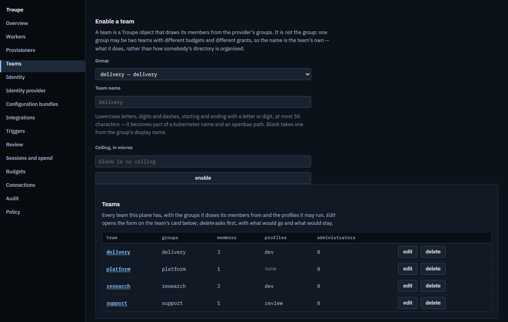

# Why Troupe

What Troupe is for, who it is for, how it compares with running an agent CLI on your
laptop, and when you do not need it. Every claim here points at the code or at the page
that says how it works. Troupe's own words are in the [glossary](glossary.md).

## Who it is for

- **An engineer who wants an agent's work to outlive the window.** A
  [session](glossary.md#session) lives in the [daemon](glossary.md#daemon) on your machine,
  not in the terminal you started it from. Start it in the terminal UI, follow it from the
  desktop app, script it with `troupe run --headless`, and all three look at the same
  session at once.
- **A team that wants agents on shared infrastructure,** with what an organisation asks of
  anything that spends money and touches code: sign-in from its identity provider, budgets
  per team and per person, an audit trail, and work that runs on the team's pods rather
  than on whichever laptop was open.
- **Somebody writing their own client or integration.** Everything a client does goes over
  [PROTOCOL.md](../PROTOCOL.md), which is complete on its own, with JSON Schema for every
  message under [`protocol/schema/v1/`](../protocol/schema/v1/). The terminal UI and the
  desktop app live in this repository and get nothing a client of yours would not.

## Troupe and an agent CLI on your laptop

If you use one of the agent CLIs today, most of what makes it useful is here too: an agent
that reads, edits and runs commands in your checkout, and asks before it changes anything.
Troupe reads `AGENTS.md` and `.agents/` as they are, and brings in once, into its own
files, what you have written for those tools: `CLAUDE.md`, `GEMINI.md`, Copilot's and
Cursor's rules, your agents and commands (`troupe onboard`); your MCP servers from an
`.mcp.json`; your skills; an opencode setup's providers
([configuration.md](user/configuration.md#onboarding-another-tools-files)). Any provider
with an Anthropic or an OpenAI API will do, behind a gateway or not.

What differs is where the work lives and what is kept of it:

| | on your laptop | with a plane |
|---|---|---|
| **Where a session runs** | in the daemon, outside any window ([ARCHITECTURE.md §2](../ARCHITECTURE.md#2-the-harness)) | on a [worker](glossary.md#worker) pod, so every laptop can be closed ([§6.2](../ARCHITECTURE.md#62-a-worker-pod)) |
| **Who can look** | every client on the machine, together: the TUI, the desktop app, a script | the same from any machine, and a colleague you share the session with |
| **What is kept** | the session's [log](glossary.md#log): append-only, hash-chained, and the session itself. Every view, restart and cost is read back from it | the same, sealed to object storage under keys the plane cannot use |
| **What it may spend** | limits on each agent's model calls, tokens and time, which ask before going further ([quick start](quick-start.md#5-cap-the-next-one)) | as well, money budgets per team, per person and for the platform, reserved before a session starts |
| **Who acts** | you | a person signed in through your identity provider, or a team's service principal, named on every event |

## What the plane buys

A [plane](glossary.md#plane) is the server a team runs on its Kubernetes cluster. What it
adds, and where each part is described:

- **Teams, from your identity provider.** A [team](glossary.md#team) is a group your
  provider already has, enabled by an administrator; Troupe keeps no passwords and no
  membership of its own ([roles-and-permissions.md](admin/roles-and-permissions.md)).
- **Budgets in money.** A team, a person and the platform each have a ceiling, a session
  reserves a slice of it when it starts, and the ledger records what the calls actually
  cost ([bundles-and-triggers.md §4](admin/bundles-and-triggers.md#4-budgets)).
- **Audit.** Every administrative change is a row with its actor and its diff, and the
  trail is chained, so that `admin.audit.verify` can tell whether a row was altered behind
  the application ([monitoring.md §4](admin/monitoring.md#4-audit-log)).
- **Pods.** A [profile](glossary.md#profile) is a kind of worker; the
  [operator](glossary.md#operator) runs its pods in a namespace of their own, and the
  [policy](glossary.md#policy) says what images they run and what hosts they may reach
  ([profiles-and-policy.md](admin/profiles-and-policy.md)).
- **Sessions that survive the client.** A session on a pod keeps going with no client
  attached, sleeps when idle and wakes when opened, on the same pod or another
  ([ARCHITECTURE.md §6.2](../ARCHITECTURE.md#62-a-worker-pod)).
- **Work nobody starts by hand.** A [trigger](glossary.md#trigger) starts a session on a
  schedule or from outside, as a [service principal](glossary.md#service-principal), on
  terms of its own, and flags it for review
  ([bundles-and-triggers.md](admin/bundles-and-triggers.md)).
- **One protocol, with no private door.** The clients use PROTOCOL.md like anyone's; the
  [console](glossary.md#console) calls the same admin methods the API and the MCP tools
  offer, and a test fails if it has a button with no method under it
  ([ARCHITECTURE.md §1](../ARCHITECTURE.md#1-shape), [§6.4](../ARCHITECTURE.md#64-the-admin-surface)).
- **A plane that cannot read your work.** It knows who, which profile, which state and what
  it cost, and no administrative method returns what a session said
  ([what Troupe never does](user/README.md#what-troupe-never-does)).

## What a plane asks of you

A plane is a real deployment, and it needs what one needs: Kubernetes 1.30 or later with a
network plugin that enforces policy, an ingress controller, PostgreSQL, an S3-compatible
bucket with versioning on, OpenBao or Vault, and an OIDC provider that issues a group claim
([installing.md](admin/installing.md)). Troupe runs none of these for you, on purpose: each
is something an organisation already has opinions about. A worker can run on a machine you
already have instead of a pod, and [single-machine.md](admin/single-machine.md) names each
guarantee it gives up.

## When you do not need it

- **You work alone on one machine.** The daemon and a client are the whole product for you,
  and a plane adds nothing you would use. Install them and skip the rest.
- **Nothing you do needs to outlive the terminal,** and the agent CLI you use does what you
  want. Troupe's differences are about where work lives and who can see it; if neither
  matters to you, switching buys little.
- **You want a hosted service.** Troupe is not one. There is nothing to sign up for, and a
  plane is yours to run.
- **You want a sandbox on your laptop.** On your machine an agent's commands run as you, in
  the directory you gave it, once you have approved them. Only on a pod do they run under
  bubblewrap, behind a network policy.
- **You need a stable 1.0.** Releases are betas, and the binaries are not code-signed. The
  protocol is versioned, and CI refuses a change to it that an older client could not
  survive, but the rest can still change between releases.
